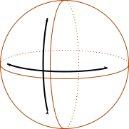
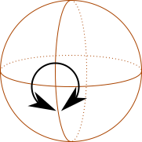
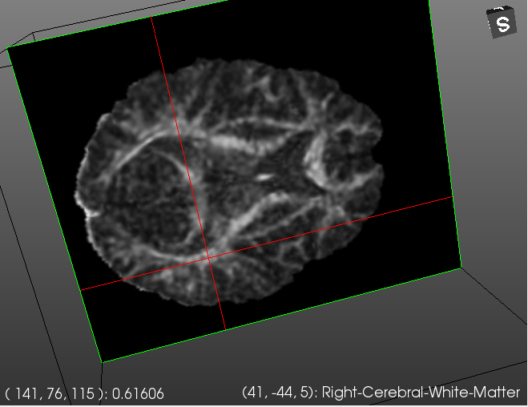
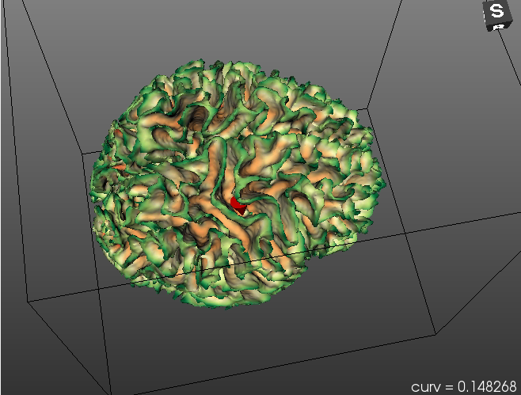
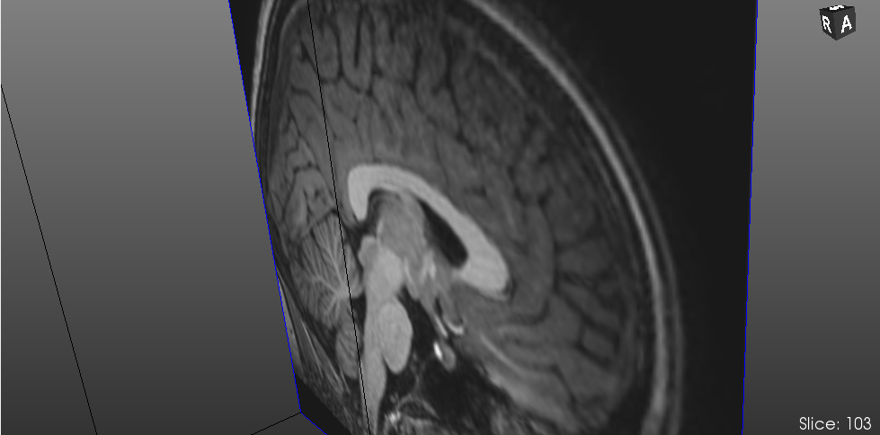
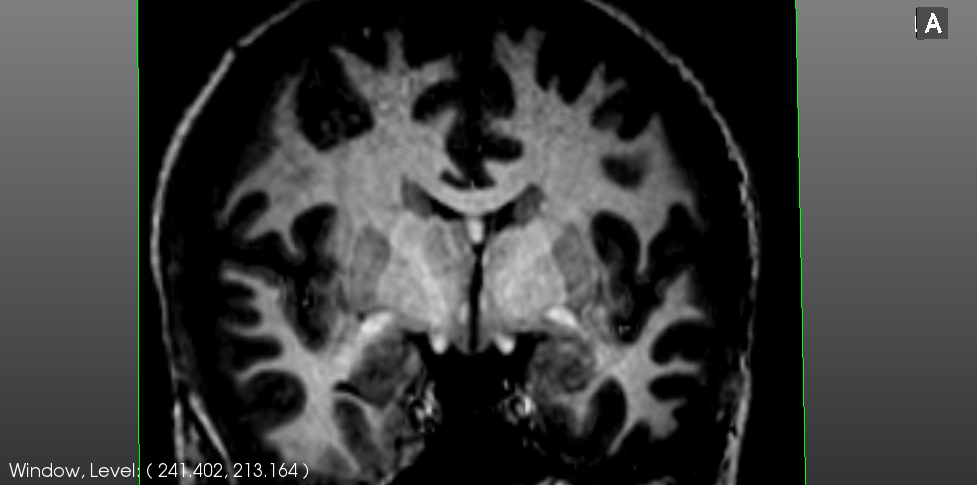

Navigating 3d views
====================

Braviz uses `vtk <http://www.vtk.org>`_ for displaying 3d data. In particular we use an interaction style called
`trackball camera <http://www.vtk.org/doc/nightly/html/classvtkInteractorStyleTrackballCamera.html#details>`_.
The mouse is used to control the camera which moves on a sphere around the view.

Rotating
---------

To rotate the camera to the left or to the right, or to the top or the bottom; click and hold the left mouse button, outside from any object, and
drag it.

To spin the camera around its own axis, press ``ctrl`` while dragging the mouse. Remember that you must start the action
away from any image or surface.

Zooming
--------

Moving the camera further or closer to the scene.

    -   Spin the mouse wheel
    -   On some touchpads you can do a *pinch* gesture
    -   Right click outside any object and drag the mouse up or down
    -   Hold ``ctrl+shift`` and drag with the left mouse button

Panning
--------

To move the camera parallel to the view plane without changing its direction

    -   Press the middel mouse button (the wheel) and drag the mouse.
    -   Hold ``shift`` and drag with the left mouse button.
    
As always the action must start away from any image or surface.

Querying images or surfaces
-----------------------------

    
When you click and hold on an image, a red cursor will appear. The lower left corner will show 
the *voxel* coordinates of the point, and the value of the image at that point,
the lower right corner will contain the *mm.* coordinates of the point and the label of the freesurfer
segmentation at that location. 

Clicking and holding on a surface will make a red cone appear. This cone allows you to query for scalar
values at specific positions on the surface. The lower right corner will show the value at the cone tip. 
    
Changing the image plane
------------------------

If you have a three button mouse you can change the current image plane by pressing the middle button (the wheel),
holding, and dragging. The current slice will be shown on the lower right corner.

Adjusting window and level
---------------------------

For most image modalities you can adjust the window and level by right-clicking on the image, holding and dragging.
The current window and level values are shown on the lower left corner.

Reset camera
----------------

Click on the 3d view and press the ``r`` key to reset the camera.
