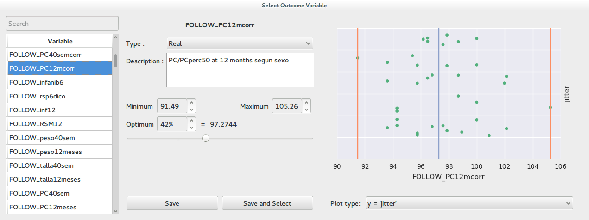
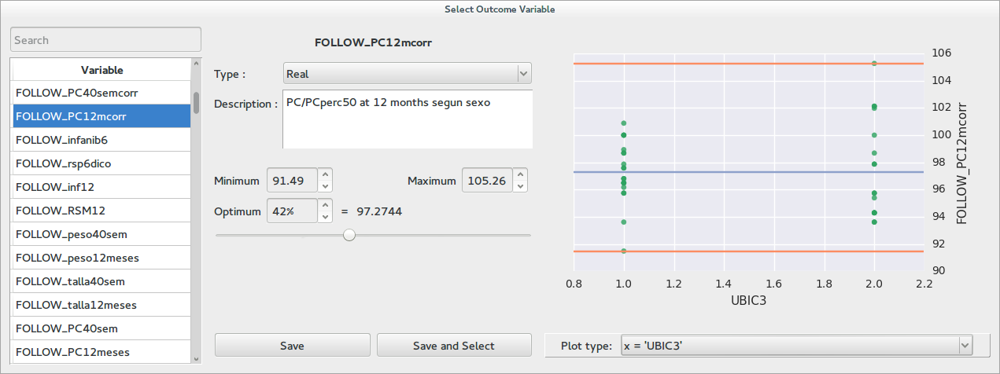
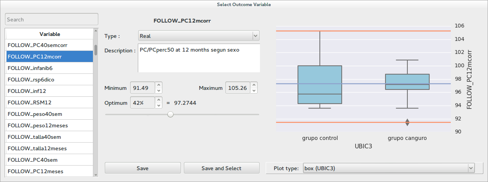
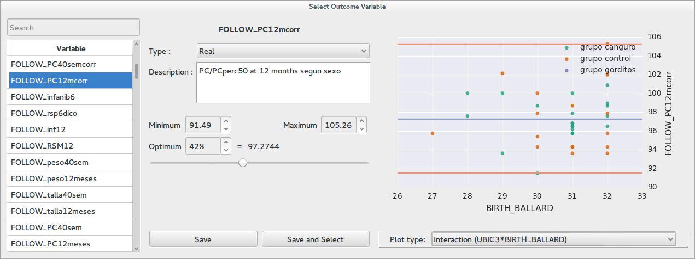
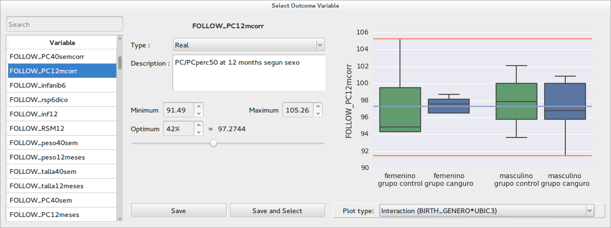
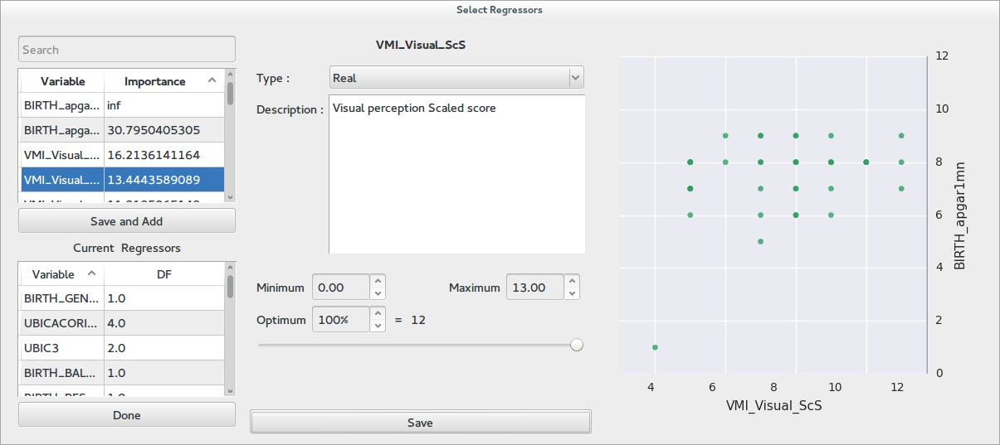
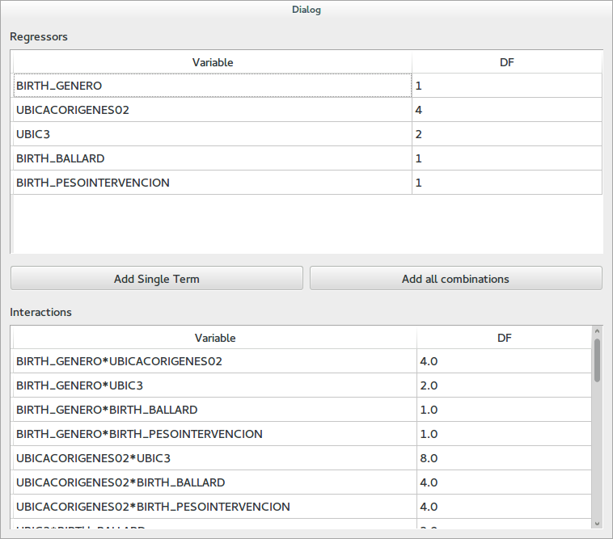
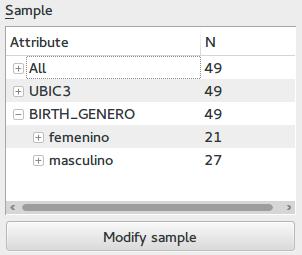
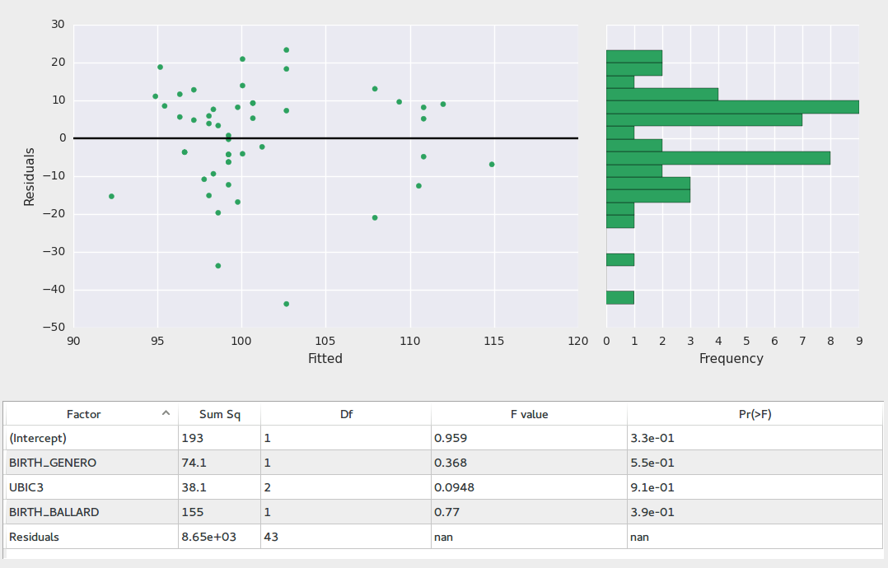

Anova
=======

.. image:: images/anova.png
    :align: center
    :width: 90%
    :alt: Anova screen-shot

This application provides an interface for performing Anova analyzes on the database variables on the
`R <http://www.r-project.org>`_ software. Type III sum of squares are used.

.. warning::
    This software is meant for exploratory analysis. When you use it you are likely doing
    `multiple comparisons <http://en.wikipedia.org/wiki/Multiple_comparisons_problem>`_
    however, the reported P values are not corrected. You must be very careful when interpreting the results.

The interface is divided in a control panel at the left, a main plot at the top right, and a results table at the
bottom right.

.. hint::
    When you hover over any point in the main plot you will see the id of the associated subject, if you right
    click you will see a context menu that will let you switch to it in other applications.

The following sections describe the steps necessary for performing an Analysis. Notice that they can be
accomplished in any order.

Selecting an Outcome
----------------------

In order to select an outcome click on the box labeled outcome. It will give you choices based on your
favorite variables (see :doc:`configuration`) and previously used outcomes. It will also have an option labeled
*select outcome*. Whe you click on it an enhanced variable select dialog will open.

Notice that at the moment only numerical outcomes are available.

If you have already added some regressors and interactions, the dialog will be able to display several plots
that integrate the regressors with the possible outcomes. In this way you can get a better a feeling of how
the outcome relates to the regressors before doing the actual calculation. The following pictures show examples
of these plots

When you are happy with the selection click on *Save and select*

Selecting Regressors and Interactions
---------------------------------------

Regressors and interactions are displayed in a table together with their associated degrees of freedom (DF).

In order to add regressors to the table click on the button labeled *Add regressor*. This will open an enhanced
variable select value.

Notice that at the variables list at the top-left there is an additional column labeled *Importance*. This column
displays the importance of each variable for predicting the value of the outcome. This value is calculated using
the `randomForest <http://cran.r-project.org/web/packages/randomForest/index.html>`_ R package. When the dialog is
first opened this values are not available, in order to perform the calculation click on the column label. To add
variables to the table of current regressors click on the button labeled *save and add*. You may also remove
regressors by right clicking on them in the table at the bottom left and clicking on remove. When you are happy
with the selection click on *Done*.

To add interactions click on the button labeled *Add Interaction*. The following dialog will open

In order to add a single interaction term select all the desired factors by clicking on them while holding the
``Ctrl`` key and afterwards click on *Add Single Term*. The *Add all combinations* button will add all possible
products from the current regressors. When you are done close the dialog.

In the main window you can see the list of regressors and interactions at the left side. In order to
remove any of them right click on it and select *remove*. Notices that if you remove a regressor, all of the
interactions that contain it will also be removed.

If you double click on any of the rows in the regressors table the main plot will display the relation
between this regressor and the outcome.

Choosing a Sample
------------------

At the lower right you will find the following tree which shows the current sample composition.

In order to select a different set of subjects to work click on the button labeled *Modify sample*. The sample
select dialog will open (see :doc:`samples`)

.. hint::
    If you double click on any node of the sample tree the subjects it contains will be highlighted in the
    main plot.

Fitting the model
------------------

When you have an outcome, and at least one regressor the *Calculate Anova* button will become active. When you click
on it the R calculation will take place and you will see the table at the bottom right fill with the results.
Also the main plot will show diagnostics from the residuals.

If the anova hypotheses are met

    -   The residuals variance should be constant along the outcome values
    -   The residuals histogram should look like a normal distribution

The results table contains columns for regressor name, sum of squares, degrees of freedom, F statistic value,
and the associated P value.

.. hint::
    If you double click on any of the rows in the results table you will see a corresponding plot.

Exporting data
---------------

The *file* dialog contains an entry labeled *export* which inside contains items that let you:

    -   Export the data used in the analysis
    -   The main plot as a vectorial graphic

Scenarios
----------

The *file* menu contains options for saving and loading scenarios. This scenarios will include the current variables,
current sample, and current plot.
