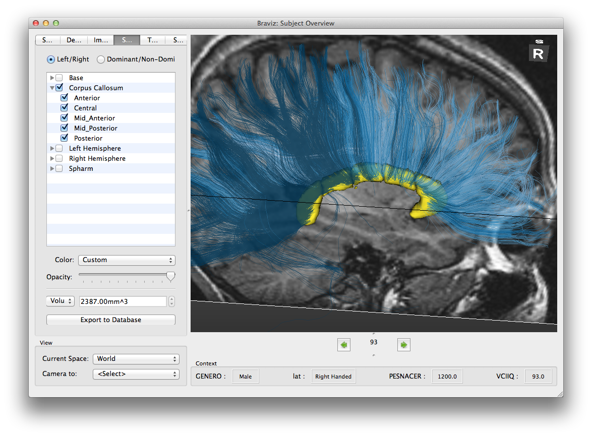

Braviz Applications
====================

This page shows the catalog of braviz graphical applications. For more information about any of them look for the
link at the bottom of each section.

Each application can be used independently, or they can be used at the same time for larger analysis. When launched
from the same menu applications are linked together and it yo can for example make them all change to a certain
subject. This allows you to have several points of view to the data at all times.

The menu
---------

.. image:: images/braviz_menu.png
    :align: center
    :width: 50%
    :alt: Braviz menu screenshot

.. toctree::
    :includehidden:
    :maxdepth: 0
    :hidden:

    menu

The starting point of the braviz system
See :doc:`menu`

Visualizing Neuro-Image data
------------------------------

These applications provide access to neuro-image data.

.. toctree::
    :includehidden:
    :maxdepth: 0
    :hidden:

    subject_overview
    sample_overview
    fmri_explore

Subject Overview
^^^^^^^^^^^^^^^^^^

Display images, bundles, surfaces and segmentation results for each subject at a time.

See :doc:`subject_overview`

Sample Overview
^^^^^^^^^^^^^^^^^^

.. image:: images/sample_overview.png
    :align: center
    :width: 50%
    :alt: Sample overview screenshot

Display data for multiple subjects at the same time.

See :doc:`sample_overview`

Explore fMRI
^^^^^^^^^^^^^^^^^^^^

.. image:: images/fmri_explore.png
    :align: center
    :width: 50%
    :alt: Explore fMRI screenshot

Visualize fMRI series.

See :doc:`fmri_explore`

Check Registration
^^^^^^^^^^^^^^^^^^^^

.. image:: images/check_reg.png
    :align: center
    :width: 50%
    :alt: Check registration screenshot

Visualize two images together.

See :doc:`check_reg`

Defining geometric objects
---------------------------

ROI Builder
^^^^^^^^^^^^^^^^^^^^

.. image:: images/roi_builder.png
    :align: center
    :width: 50%
    :alt: Roi builder screenshot

Place spherical ROIs for each subject.

See :doc:`check_reg`

Logic bundles
^^^^^^^^^^^^^^^^^^^^

.. image:: images/logic_bundles.png
    :align: center
    :width: 50%
    :alt: Logic bundles screenshot

Define bundles using segmented structures, rois and logical operations.

See :doc:`check_reg`

Measure
^^^^^^^^^^^^^^^^^^^^

.. image:: images/measure.png
    :align: center
    :width: 50%
    :alt: Measure screenshot

Manually measure features on images for each subject.

See :doc:`check_reg`

.. toctree::
    :includehidden:
    :maxdepth: 0
    :hidden:

    check_reg
    build_roi
    logic_bundles
    measure

Statistical visualization
----------------------------

.. toctree::
    :includehidden:
    :maxdepth: 0
    :hidden:

    anova
    lm
    correlations
    parallel

Managing data
---------------

.. toctree::
    :includehidden:
    :maxdepth: 0
    :hidden:

    from_excel
    export_csv

