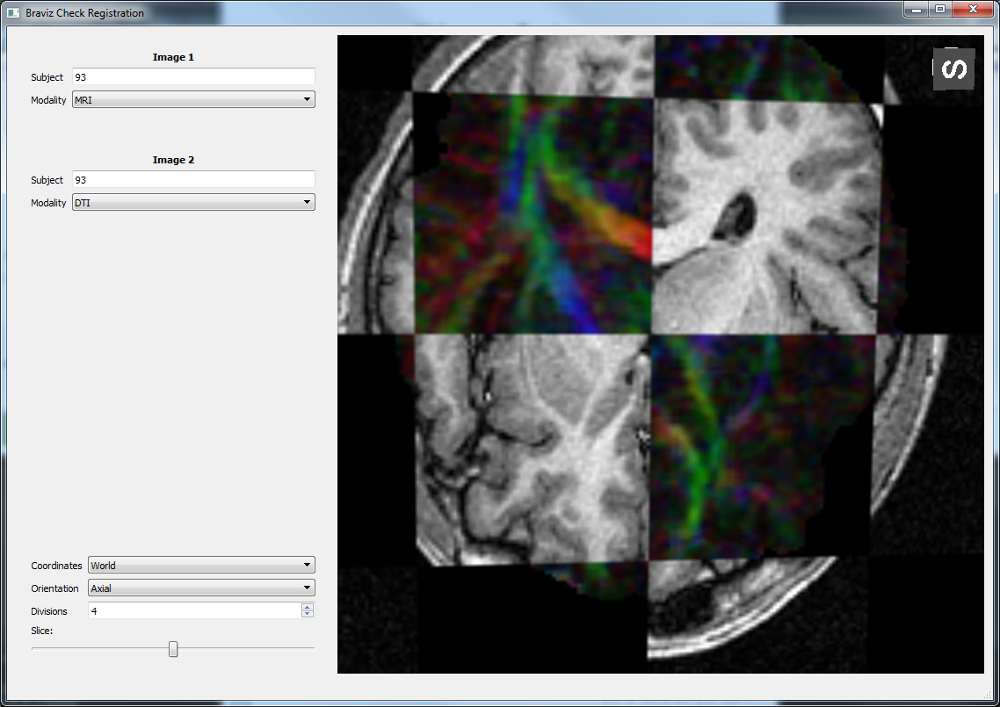

Braviz Applications
====================

This page shows the catalog of braviz graphical applications. For more information about any of them look for the
link at the bottom of each section.

Each application can be used independently, or they can be used at the same time for larger analysis. When launched
from the same menu applications are linked together and it yo can for example make them all change to a certain
subject. This allows you to have several points of view to the data at all times.

The menu
---------

.. image:: images/braviz_menu.png
    :align: center
    :width: 50%
    :alt: Braviz menu screenshot

.. toctree::
    :includehidden:
    :maxdepth: 0
    :hidden:

    menu

The starting point of the braviz system

See :doc:`menu`

Visualizing Neuro-Image data
------------------------------

These applications provide access to neuro-image data.

.. toctree::
    :includehidden:
    :maxdepth: 0
    :hidden:

    subject_overview
    sample_overview
    fmri_explore
    check_reg

Subject Overview
^^^^^^^^^^^^^^^^^^

.. image:: images/subj_overview.png
    :align: center
    :width: 50%
    :alt: Subject overview screen-shot

Display images, bundles, surfaces and segmentation results for each subject at a time.

See :doc:`subject_overview`

Sample Overview
^^^^^^^^^^^^^^^^^^

.. image:: images/sample_overview.png
    :align: center
    :width: 50%
    :alt: Sample overview screen-shot

Display data for multiple subjects at the same time.

See :doc:`sample_overview`

Explore fMRI
^^^^^^^^^^^^^^^^^^^^

.. image:: images/fmri_explore.png
    :align: center
    :width: 50%
    :alt: Explore fMRI screen-shot

Visualize fMRI series.

See :doc:`fmri_explore`

Check Registration
^^^^^^^^^^^^^^^^^^^^

Visualize two images together.

See :doc:`check_reg`

Defining geometric objects
---------------------------

.. toctree::
    :includehidden:
    :maxdepth: 0
    :hidden:

    build_roi
    logic_bundles
    measure

ROI Builder
^^^^^^^^^^^^^^^^^^^^

.. image:: images/roi_builder.png
    :align: center
    :width: 50%
    :alt: Roi builder screen-shot

Place spherical ROIs for each subject.

See :doc:`build_roi`

Logic bundles
^^^^^^^^^^^^^^^^^^^^

.. image:: images/logic_bundles.png
    :align: center
    :width: 50%
    :alt: Logic bundles screen-shot

Define bundles using segmented structures, rois and logical operations.

See :doc:`logic_bundles`

Measure
^^^^^^^^^^^^^^^^^^^^

.. image:: images/measure.png
    :align: center
    :width: 50%
    :alt: Measure screen-shot

Manually measure features on images for each subject.

See :doc:`measure`

Statistical visualization
----------------------------

Visualize variables stored in the database.

.. toctree::
    :includehidden:
    :maxdepth: 0
    :hidden:

    anova
    lm
    correlations
    parallel

Anova
^^^^^^^^^^^^^^^^^^^^

.. image:: images/anova.png
    :align: center
    :width: 50%
    :alt: Anova screen-shot

Perform and visualize anova analyzes.

See :doc:`anova`

Linear Model
^^^^^^^^^^^^^^^^^^^^

.. image:: images/linear_model.png
    :align: center
    :width: 50%
    :alt: Linear model screen-shot

Fit linear models

See :doc:`lm`

Correlations
^^^^^^^^^^^^^^^^^^^^

.. image:: images/correlations.png
    :align: center
    :width: 50%
    :alt: Correlations screen-shot

Quickly visualize correlations between variables

See :doc:`correlations`

Parallel coordinates
^^^^^^^^^^^^^^^^^^^^^^

.. image:: images/parallel.png
    :align: center
    :width: 50%
    :alt: Parallel coordinates screen-shot

Visualize multiple variables using a parallel coordinates

See :doc:`parallel`

Managing data
---------------

Import and export variables from the database

.. toctree::
    :includehidden:
    :maxdepth: 0
    :hidden:

    from_excel
    export_csv

Import excel tables
^^^^^^^^^^^^^^^^^^^^^^

.. image:: images/from_excel.png
    :align: center
    :width: 50%
    :alt: Import from excel dialog

Add variables to the database from excel spreadsheets.

See :doc:`from_excel`

Export variables
^^^^^^^^^^^^^^^^^^^^^^

.. image:: images/export_vars.png
    :align: center
    :width: 50%
    :alt: Export variables dialog

Select variables and export them as comma separated files

See :doc:`export_csv`

