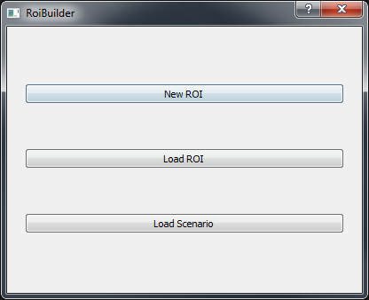
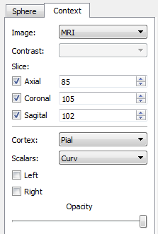
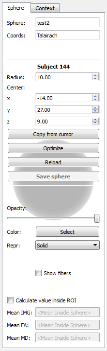
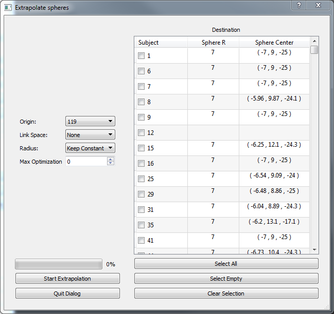

ROI Builder
============

.. image:: images/roi_builder.png
    :align: center
    :width: 90%
    :alt: Roi builder screenshot

This application allows you to place spherical regions of interest on each subject of the sample. The sphere can be
adjusted independently for each subject, in size and in position. It is also possible to extrapolate the position of
the sphere from one subject to others in order to get plausible starting points, afterwards small adjustments
can be made. Before entering the real application you will find a start dialog.

In other words, in this application you define individual spheres for each subject. This spheres are grouped into
one name. Later on, the system accesses each sphere through the ROI name and subject id.

Start dialog
-------------

In the startup dialog you have to choose one of the following options

    -   **New ROI**: Create a new set of spheres (one for each subject), you will be asked for a name, a description
        and a coordinate system. Notice that spheres will, in general, only be spheres in one coordinate system. After
        applying a linear transformation they will likely look as ellipses, while after applying a non linear
        deformation they can look like blobs.
    -   **Load ROI**: Continue working on an existing sphere set.
    -   **Load scenario**: Load a scenario to re take the work exactly where you left it a previous time. See
        *Saving Scenarios* below

Main Application
------------------

The main application is composed of three panels, at the left there is a tabbed box where you can choose the
context or the sphere panel (look below). At the middle is a 3d viewer, and at the right side is a list of subjects
with checkboxes. The checkboxes represent the subjects to which a sphere has been defined. As you start saving spheres,
you will see check-marks start to appear. The objective of the application is to go through all subjects and defining
ROIs.

.. hint::
    You can press the right and left arrow keys in the keyboard to move trough the subjects in the list

.. _roi-builder-context-panel:

Context Panel
^^^^^^^^^^^^^^

The context panel allows you to add images and surfaces to the viewer so that you can better find the desired
position for the ROI. The *Image* and *Contrast* control lets you choose an image modality and a contrast in case
the modality is an fMRI paradigm. Below these there are three *Slice* controls which let you manipulate the slice
of each plane individually. Using the checkbox next to each plane you can activate it or de activate it. Notice it is
still possible to change the slice by using the middle mouse button (see :doc:`3dviews`).

The lower half of the panel lets you add freeSurfer surfaces. The *cortex* and *scalar* boxes let you select the kind
of surface you are interested in and the scalars you want to draw on it. The checkboxes labeled *left* and *right* let
you activate or deactivate the surface for the respective hemisphere. Finally the opacity slider lets you add some
transparency so that you can see what is behind the surfaces.

Sphere Panel
^^^^^^^^^^^^^^

The sphere panel is where you will control the attributes of the ROI. At the top there is a reminder of the ROI name
and the coordinates system. Next we have the current subject and the associated sphere, which is characterized by
a *radius* and the *x*, *y* and *z* coordinates of its center. You can manipulate this values directly using the
mouse and keyboard.

The *copy from cursor* button will translate the sphere center to the position of the cursor on an image or on a surface.
By clicking on an image in the context viewer a cursor in form of a red cross will appear; if you instead click on
a surface a red cone will appear. Pressing this button will translate the sphere to the active cursor.

.. hint::
    You can also move the sphere center towards the cursor by pressing the *c* key in the keyboard.

The button labeled *Optimize* will move the sphere to the place of maximum FA in a small neighborhood.

The button labeled *reload* will restore the sphere position and size to the one previously stored in the database.

To save the modifications of the sphere into the database you must press the *Save sphere* button. Pay special
attention to this button, whenever it is active it means there are unsaved changes.

The next part of the panel lets you control visual attributes of the sphere. First is a slider for adjusting the
sphere opacity, afterwards a button where you can select a color for the sphere,
and finally a box which lets you choose between solid or wire-frame representations.

The *Show fibers* checkbox lets you preview the fibers that go through the current sphere, and the
*Calculate value inside ROI* checkbox lets you see the mean value (of the current context image), the mean FA,
and the mean MD; calculated over the voxels inside the current sphere.

The extrapolate dialog
^^^^^^^^^^^^^^^^^^^^^^^^

To load this dialog click on the bottom labeled *Extrapolate* at the bottom right corner. This dialog lets you
approximate the sphere coordinates for several subjects based on a reference subject. Internally it makes use of
coordinate system changes.

At the left you can select the *origin* subject from which the sphere position will be extrapolated, the *link space*
which is the coordinate system that will be used to map from one subject to another, if you want to adjust the sphere
size or only its position (keep radius constant), finally you may apply an FA optimization after estimating the sphere
center. The control labeled *Max Optimization* lets you choose the maximum distance (in the current coordinate system).
Choose zero to disable this optimization.

At the right side there is table showing the current sphere radius and center for each subject. Use the checkboxes to
select the subjects to which you want to apply the estimation. At the bottom of the list there are buttons which let
you *select all subjects*, *select empty* (only subjects who don't yet have any sphere), or to clear all subjects.

To start the extrapolation click the *Start exploration* button at the lower left. The progress bar on top of it
will start to fill. Notice that this process may take significant time, and that the interface may freeze in the
middle.

Changing the current sphere
^^^^^^^^^^^^^^^^^^^^^^^^^^^^

If you want to start working on a different ROI, you don't have to close the application. The *File* menu contains
two items that let you change to a different ROI without changing anything else in the application.

    -   **Save sphere as**: Create a new ROI and save the current sphere as the sphere for the current subject.
    -   **Switch sphere**: Change to another, existent ROI. Notice this will keep the sphere in its current position,
        if you want to load the sphere already defined in the new ROI click on *Reload*.

Working with multiple spheres
^^^^^^^^^^^^^^^^^^^^^^^^^^^^^^

If you want to work with multiple spheres simultaneously, click on the arrow next to the sphere name; and at the
end of the combobox click on *<Multiple spheres>*, a dialog will open where you will be able to
select additional ROIs. Notice that only spheres designed in the same space as the current one are available.

After closing the dialog you will see the combobox populated with your choices. If you select one of them it will
become the active sphere. You will be able to move it, resize it, see values inside it, extrapolate it and export it.

When multiple spheres are on the scene, the *show fibers* box will display only streamlines that cross all of the ROIs.

Exporting rois
^^^^^^^^^^^^^^^^

The file menu contains an item labeled *Export Roi* which allows you to export the sphere as a nifti image, which
contains ones in voxels inside the sphere, and zeros in the background.

Scenarios
^^^^^^^^^^

As usual, the *File* menu contains items for saving and loading scenarios. In this case scenarios include everything
but the roi position or size, this data is only recorded in the database. The camera, context and visual attributes,
current subject and current ROI will be saved.
