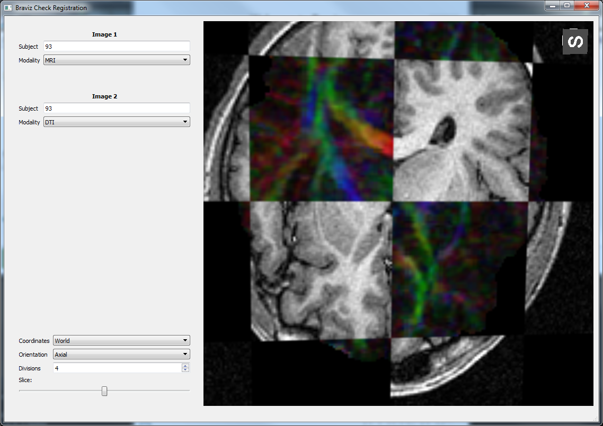

Check Registration
====================

This application lets you compare two images by showing them using a chess board pattern. Its interface contains
a control panel on the left and a 3d viewer on the right.

The control panel starts with a two pairs of boxes which let you choose a subject and an image modality. These are
the two images that you want to compare. Notice this application lets you compare two images from the same subject
as well as images from different subjects. Afterwards there are boxes for selecting the coordinate system, and the
orientation of the image. Next is a control which lets you increase or decrease the number of rows and columns
that make the chess board pattern. Finally there is a slider which lets you move the plane in its
perpendicular direction.

Comparing images from the same subject
----------------------------------------

This application can be used to compare different image moadilities in order to verify that the registration
algorithm was successful. This test can be done in all of the coordinate systems. It is specially important to check
diffusion images (FA), against anatomical images (MRI).

Comparing different subjects
------------------------------

This application may also be used to compare images belonging to different subjects. It is most useful when the
coordinate system is Talairach or Dartel. In this case the application can also verify the effectiveness of the two
kinds of common coordinate systems. 