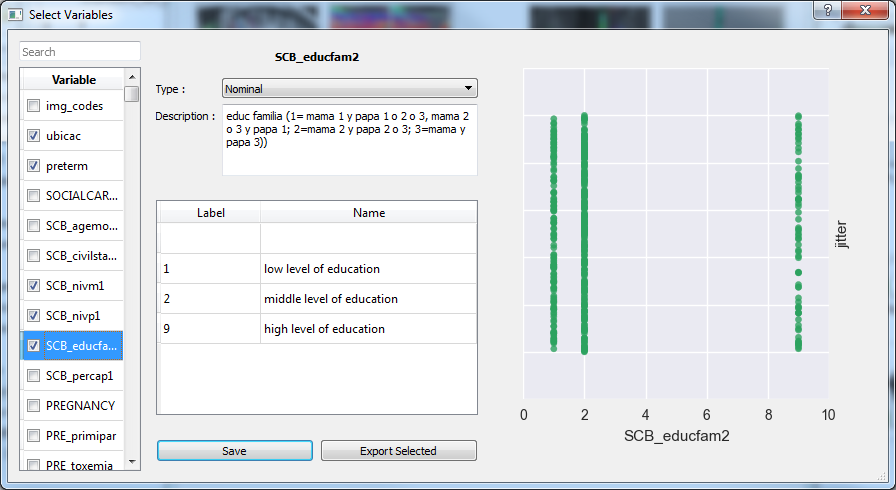

Exporting variables
====================

This dialog lets you take variables from the database in order to perform further analyzes or processing in other
software. Variables are exported in a csv format which can be easily read by statistical software.

Procedure
----------

Check the boxes next to the variables you desire in the list at the left side, you may use the field at the top
to search for particular variables (see :doc:`variables`). When you are done with the selection click on the
*export selected* button, a dialog will open prompting you where to save the file. The output file will contain
a column with subject indices followed by one column for each variable. The first row contains variable names.
Missing values will be represented as empty strings.
