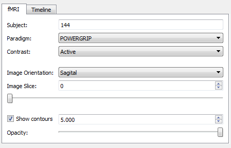
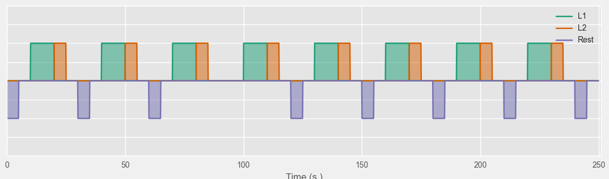
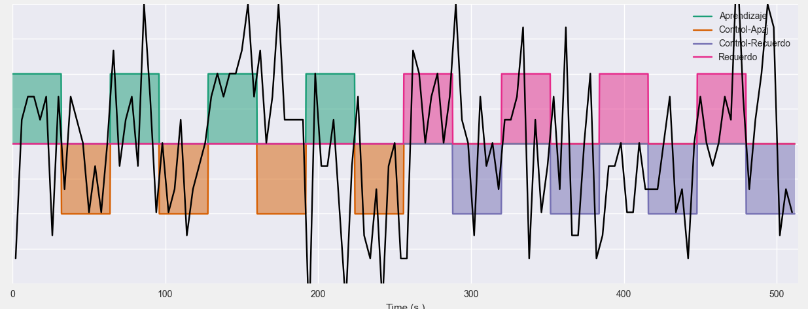
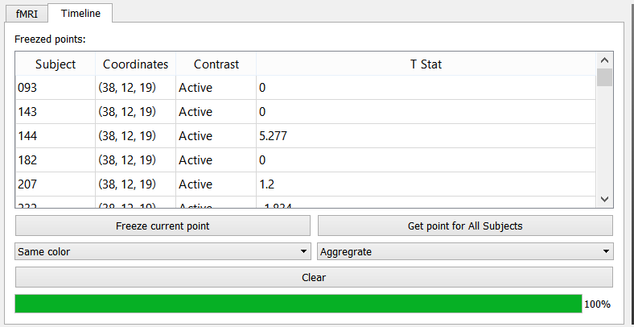
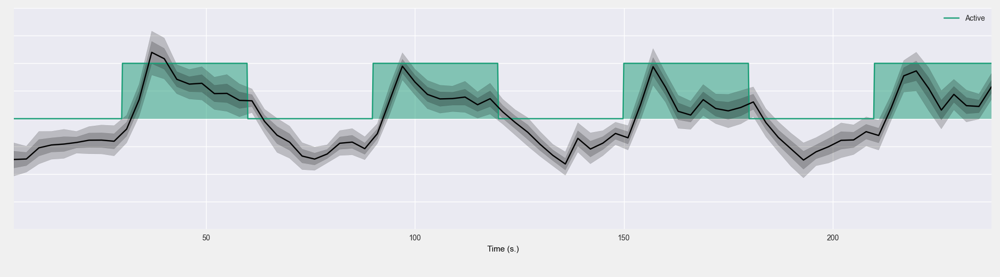

Explore fMRI
==============

.. image:: images/fmri_explore.png
    :align: center
    :width: 90%
    :alt: Explore fMRI screenshot

In this application you can visualize the underlying BOLD signal of fMRI paradigms. The interface is divide in three.
At the top we have a tabbed panel for controlling the application and next to it a 3d viewer. Below is a plot where
the *x* axis corresponds to time. All of these elements will be further explained below.

fMRI panel
-----------

The fMRI panel lets you control the current subject, fMRI paradigm, contrast to show; using the controls with the
corresponding labels. It also lets you change to orientation of the image plane, and move along the different slices.
Finally there is a check-box which allows you to display *iso-contours* at a certain *z-score* value. The slide at
the bottom, lets you add transparency to these contours.

The time plot
--------------

The time plot at the bottom of the application shows the experiment along the time domain. The stimulus that make
up the current contrast are shown as block signals in different colors

When you click on a point of the image in the 3d viewer, the raw BOLD signal measured at that point will be displayed
on the graph

You can move the cursor around in the 3d viewer, and the bold signal will update.

Working with bold signals
---------------------------

Exporting data
---------------

Samples and scenarios
----------------------

