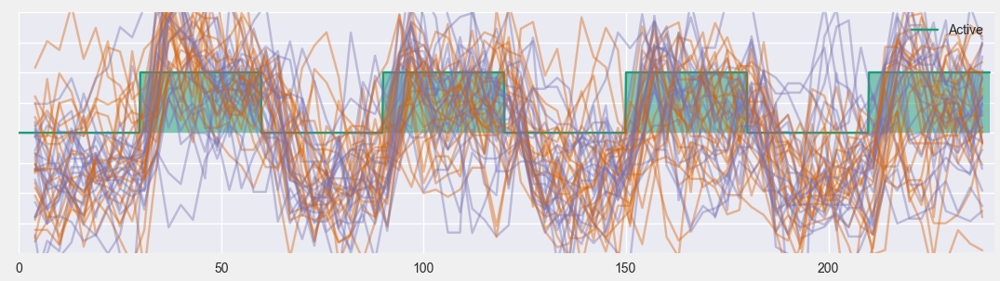

Explore fMRI
==============

.. image:: images/fmri_explore.png
    :align: center
    :width: 90%
    :alt: Explore fMRI screenshot

In this application you can visualize the underlying BOLD signal of fMRI paradigms. The interface is divide in three.
At the top we have a tabbed panel for controlling the application and next to it a 3d viewer. Below is a plot where
the *x* axis corresponds to time. All of these elements will be further explained below.

fMRI panel
-----------

.. image:: images/fmri/fmri_fmri_panel.png
    :align: center
    :alt: The fmri panel

The fMRI panel lets you control the current subject, fMRI paradigm, contrast to show; using the controls with the
corresponding labels. It also lets you change to orientation of the image plane, and move along the different slices.
Finally there is a check-box which allows you to display *iso-contours* at a certain *z-score* value. The slide at
the bottom, lets you add transparency to these contours.

The time plot
--------------

The time plot at the bottom of the application shows the experiment along the time domain. The stimulus that make
up the current contrast are shown as block signals in different colors

.. image:: images/fmri/fmri_estimulus.png
    :align: center
    :width: 90%
    :alt: A bold signal

When you click on a point of the image in the 3d viewer, the raw BOLD signal measured at that point will be displayed
on the graph

.. image:: images/fmri/fmri_bold.png
    :align: center
    :width: 90%
    :alt: A bold signal

You can move the cursor around in the 3d viewer, and the bold signal will update.

Working with bold signals
---------------------------

.. image:: images/fmri/fmri_timeline_panel.png
    :align: center
    :width: 90%
    :alt: Aggregate signal

The *Timeline* panel lets you perform several operations with BOLD signals. You can add several lines to the plot,
which will be shown on the table labeled *frozen points*. The table has the following columns:

    -   **Subject**: The subject to whom the signal belongs
    -   **Coordinates**: The spatial coordinates at which the bold signal was sampled
    -   **Contrast**: The active contrast when the signal was sampled
    -   **T Stat**: The T statistic value corresponding to the signal and the contrast.

.. hint::
    When you click on a row of the table the corresponding signal will be highlighted in the plot

To remove a signal, right click on its name on the table and from the context menu select "remove". To remove all
signals from the table click on the button labeled *Clear*.

To add the current bold signal to the table, click on the button *Freeze current point*. You can retrieve the
current point for all subjects in the current sample by clicking on *Get point for all subjects*.

By default all lines are shown in the same color, but you may also color them with respect to a nominal variable,
or by grouping the signals by the location at which they were sampled. This is achieved using the box below the
*Freeze current point* button.

The above graph show several lines on top of each other, it is also possible to group lines of the same color into
groups and show them as in the following graph. This is done using the box below *Get point for all subjects*.
The graph displays the mean signal, and the confidence interval based on all the lines in the group.

.. image:: images/fmri/fmri_agg_time.png
    :align: center
    :width: 90%
    :alt: Aggregate signal

Exporting data
---------------

Samples and scenarios
----------------------

