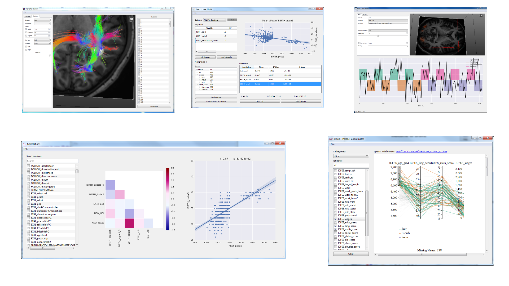

Visual Analytics with Braviz
==============================

Quick links
--------------

.. toctree::
    :includehidden:
    :maxdepth: 1

    concepts
    general
    applications

Introduction
--------------

The braviz system is a collection of small applications tailored for specific tasks. The idea is that each application
should be easy to understand and use. Nevertheless, applications are connected to each other in several ways which
permits to complete more complicated tasks.

If none of the available applications fit the task at hand, a new application may be developed and integrated into
the current system using braviz as a library.

Features
---------

    -   Visualize neuro-image data with tabular data as context
    -   Immediately visualize the same data for different subjects
    -   Select across different coordinate systems
    -   Visualize rational and nominal variables
    -   Navigate between variables and images
    -   Create new variables based on neuro-image data
    -   Perform basic statistics without leaving the system
    -   Import excel spreadsheets into the system
    -   Export variables as csv files
    -   Create sub-samples and use them across the system
    -   Optimized for environments with multiple displays

Where to start
---------------

Braviz is designed to be easy to use, just launch the menu and start exploring. All buttons and controls have
explanatory tooltips. After playing with the system for a while, you should head into the following sections:

    -   :doc:`Concepts <concepts>`: Definitions of samples, coordinate systems, variables, scenarios and other concepts
        used across the system.
    -   :doc:`Braviz interface <general>`: Using the 3d viewers, selecting variables, saving and loading scenarios
        and more actions that apply to the whole system.
    -   :doc:`Applications <applications>`: Description and instructions specific for specific each application.

Frequently asked questions
----------------------------

**Where can I get Braviz?**

The source code is available in a `bitbucket repository <https://bitbucket.org/dieg0020/braviz/>`_

|

**Under what license is Braviz distributed?**

The `lesser general public license <https://www.gnu.org/licenses/lgpl.html>`_

|

**Where can I report bugs or ideas for improvements?**

Please use the `issue tracker <https://bitbucket.org/dieg0020/braviz/issues/new>`_

|

**I clicked too fast and now the system is changing subjects like crazy, how do I stop it?**

Click the world icon
at the lower left of the menu, this will disconnect communications between applications and should stop the loop. Wait
until all applications stabilize and reconnect communications.

|

**How do I rotate the image in the 3d viewer?**

Read :doc:`3dviews`

|

**How do I change the current project?**

Use the configuration file ``braviz.cfg`` found at the braviz applications directory. For more information
read :doc:`configuration`

|

**What kind of data does Braviz support?**

The current version can be used with

    -   Neuro-Images:

        -   Anatomical MRI images
        -   `FreeSurfer <http://freesurfer.net/>`_ Segmentation and Surface reconstruction
        -   DTI images
        -   Tractographies
        -   `Tracula <http://surfer.nmr.mgh.harvard.edu/fswiki/Tracula>`_ bundles
        -   Functional BOLD series
        -   `SPM <http://www.fil.ion.ucl.ac.uk/spm/>`_ first level analyses

    -   Tabular Data

        - Real variables
        - Nominal variables
