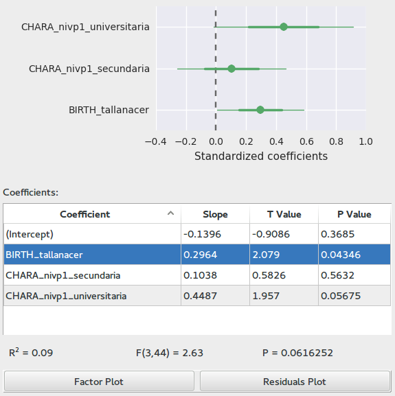
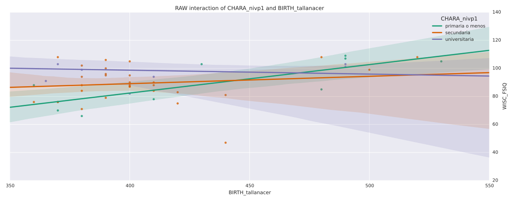
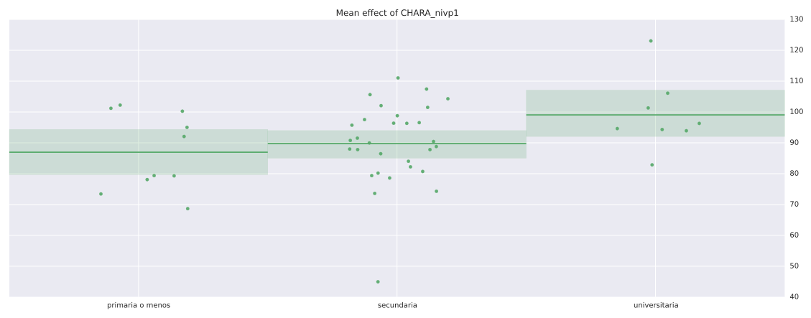

Linear Models
==============

.. image:: images/linear_model.png
    :align: center
    :width: 90%
    :alt: Linear model screen-shot

This application lets you fit linear models to data in the database. It is closely related to the
:doc:`Anova <anova>` application. In fact you will see it behaves almost in the same way.

Differences from Anova
-----------------------

    -   Nominal variables with more than two levels are split into
        `dummy variables <http://en.wikipedia.org/wiki/Dummy_variable_(statistics)>`_
    -   Variable values are `standardized <http://www.inside-r.org/packages/cran/arm/docs/standardize>`_
        in the following way:

        -   Numerical variables will have a mean of 0 and an standard deviation of 0.5
        -   Binary Nominal values will have a mean of 0 and a difference of 1 between the two categories
        -   Nominal values with more than three levels are unchanged

    -   Only scatter plots, no boxes
    -   It is possible to see effects of variables after removing effects from other variables
    -   Variable select dialogs are not enhanced

Selecting Outcome and Regressors
----------------------------------

In order to select an outcome variable, regressors and interaction terms; follow the same procedure as in
:doc:`Anova <anova>`, however here you will not get *importance* metrics, nor additional plots.

Sample
-------

The sample tree and the *Modify Sample* button are identical to those in :doc:`Anova <anova>`.

Fitting the linear model
-------------------------

Once you have selected an outcome, regressors and interactions; you may click on the
*Calculate Linear Regression* button to fit the model. The table will fill and you will
see a Factor plot (also known as `coefficient plot <http://www.carlislerainey.com/2012/06/30/coefficient-plots-in-r/>`_.
This plot shows the 95% confidence intervals and standard errors for all factors in the model. The usual interpretation
is that if the interval intersects the zero line then there is no significant effect of that coefficient. Also,
the further away the coefficient is from the zero line, the larger the effect it has on the outcome.

You may switch to the residuals diagnostic plot explained in :doc:`Anova <anova>` by clicking on
*Residuals plot*.

Also notice that in this case the results table includes the slope, T statistic and associated P value for
each coefficient; and underneath we can find the :math:`R²`, F statistic and associated P value for the
whole model.

For nominal variables with more than two levels, the first level is taken as reference. The table will contain
a coefficient for the effect of each level with respect to the first level.

Raw and Mean effects
---------------------

This application can generate two kinds of scatter plots. When you double click on the rows of the *Regressors*
table at the left side, you will see the *Raw* effect of that variable. This is a simple scatter plot of the
values of the two variables.

If instead you click in the rows of the results table, you will see a plot of the *Mean* effect. This is a scatter
plot of the values of the variables, against the values of the outcome *minus* the value predicted by the other
variables in the model. In other words, the plot illustrates the effect this variable has after accounting for
all other variables.

Scenarios and Exporting
-------------------------

The items in the *file* menu are identical to those in :doc:`Anova <anova>`.
The following plots were exported using the export image option.

