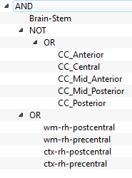

Logic Bundles
===============

.. image:: images/logic_bundles.png
    :align: center
    :width: 90%
    :alt: Logic bundles screenshot

This application allows you to define fiber bundles based on

    -   Segmented structures
    -   ROIs
    -   Logical operations

Bundles are defined as a logical tree. For example

This tree would be expanded as

    The bundles that pass trough Brainstem,
    don´t pass through any of the segments of the corpus callosum,
    and pass through the white matter or the gray matter
    of the right precentral or post central cortical areas.

In mathematics notation, let's define

    -   :math:`B` : The bundles that go through the brain-stem
    -   :math:`C_{A}` : The bundles that go through the anterior corpus callosum
    -   :math:`C_{MA}` : The bundles that go through the mid-anterior corpus callosum
    -   :math:`C_{C}` : The bundles that go through the central corpus callosum
    -   :math:`C_{MP}` : The bundles that go through the mid-posterior corpus callosum
    -   :math:`C_{P}` : The bundles that go through the posterior corpus callosum
    -   :math:`W_{PO}` : The bundles that go through the white matter of the right postcentral area
    -   :math:`G_{PP}` : The bundles that go through the gray matter of the right postcentral area
    -   :math:`W_{PR}` : The bundles that go through the white matter of the right precentral area
    -   :math:`W_{PR}` : The bundles that go through the gray matter of the right precentral area

The tree in this case would be the set

.. math::
    \left( B \setminus \left(C_{A} \cup C_{MA} \cup C_{C} \cup C_{MP} \cup C_{P} \right) \right) \cap \left( W_{PO} \cup G_{PR} \cup W_{PR} \cup G_{PR}  \right)

Interface
----------

The graphical interface contains at the right side a list of subjects, where you can double click on any of them to
switch to it. In the middle is a 3d viewer that shows the waypoints, bundles and context data. At the left side is
a tabbed panel that contains a context tab, and a bundle tab. The context tab is identical to the one in the
*ROI builder* application (see :ref:`roi-builder-context-panel`), but it also lets you change the coordinate system.

The bundle panel is where you will do most of the work, at the top it contains a tree representation of the bundle.
Below are the controls for adding the tree different kinds of node. The process of creating a bundle will be explained
in the next section. Below is an slider which lets you add transparency to the waypoint representations, and finally
a checkbox which lets you preview the bundle that would be defined using the current tree. Below the checkbox is
a box in which you can select an scalar metric of the bundle, and at the end a button that lets you export this
metric into the database.

Creating Bundles
-----------------

Fiber bundles are defined using a logical structure, which is represented as a tree. This tree may contain three
kind of nodes

    -   **Logic Node**: May be *AND*, *OR*, or *NOT*. All of the children from this nodes are joined using the
        operation. For example two different children under an *AND* node will select the bundles that go
        trough both of them.
    -   **Segmented Structure**: Selects the fibers that go through a free surfer segmented structure.
    -   **ROI**: Selects the fibers that go trough a ROI created using the *ROI Builder* application.

Notice that only *Logic* nodes may have children. The other two kind of nodes will always be leaves.

To add a node click on the node that you want as parent, and afterward click on the respective button.

To remove a node, right click on it and select remove from the context menu.

.. hint::
    When you click on a node in the tree, the structures or rois that lay under it will be highlighted in the
    3d view.

