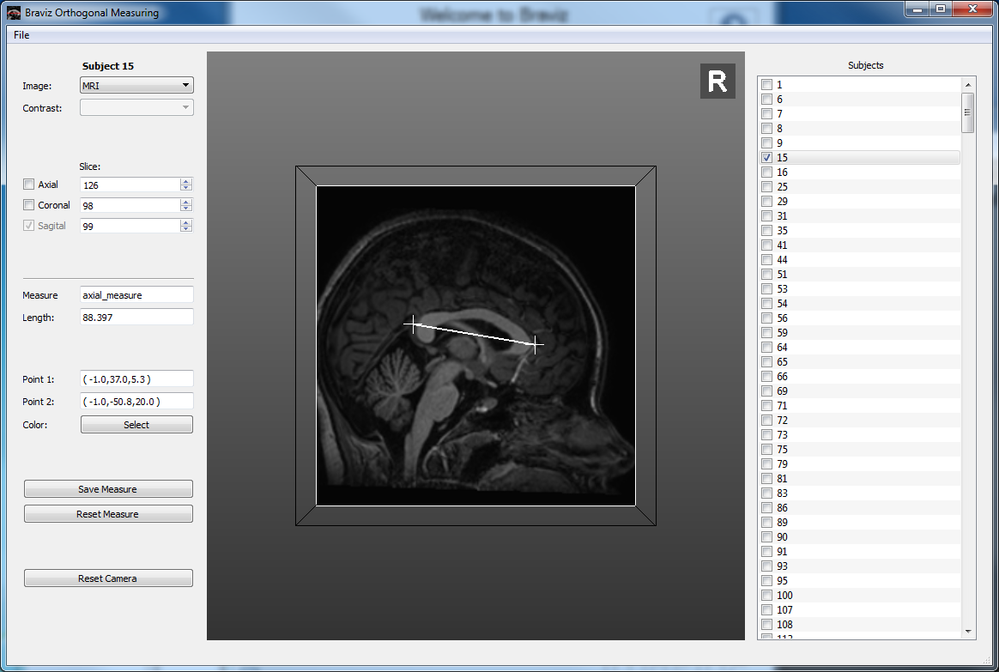
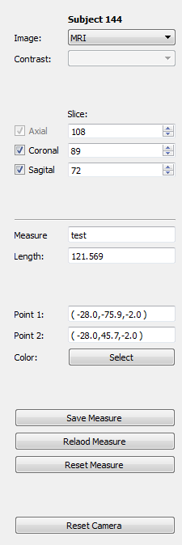

Measure
========

In this application you can measure objects in any of the orthogonal planes in a Talairach coordinate system. It works
in a similar way to the :doc:`Roi Builder <build_roi>` application. When you first open the application you will be
presented with three options

    -   **New measure**: Define a new measure
    -   **Load measure**: Keep working on an already defined measure
    -   **Load Scenario**: Load a saved scenario, which includes a measure, a subject, context items and camera angle.

Main application
------------------

The interface is divided in three panels. At the left we have the control panel, in the middle a 3d viewer and at
the right a list of subjects with check-marks. As in the :doc:`Roi Builder <build_roi>` the objective is to define the
measure for all subjects.

Control panel
^^^^^^^^^^^^^^

The control panel consists of a top section where you can define the type of image you want to see. As usual there
is a box for selecting the image modality and in case you choose a functional paradigm a box for selecting the contrast.
This section also contains controls for selecting the slices of each of the panel, and checkboxes for activating
or deactivating each plane. Notice that the measure plane is always active.

The bottom section shows the details of the current measure. First is the name, followed by the length of the current
line and the location of the two points (start and end). Afterwards there is a button that allows you yo change
the color of the line.

Next is a group of buttons

    -   **Save Measure**: Save the current line to the database
    -   **Reload Measure**: Reload the line from the database, discarding all changes.
    -   **Reset Measure**: Remove the two points from the viewer

Finally there is a button that resets the camera to the initial position on top of the measure plane.

Measuring
----------

When you first open the main application there will be no lines in the viewer. The first click on the
measure plane will add the first point of the line, and the second click will finish setting the line.
Afterwards you may drag each of the points to modify the line. Notice that moving the measure plane will also
translate the line.

