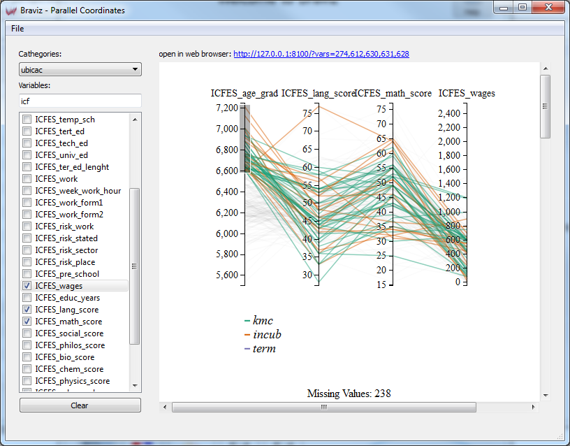
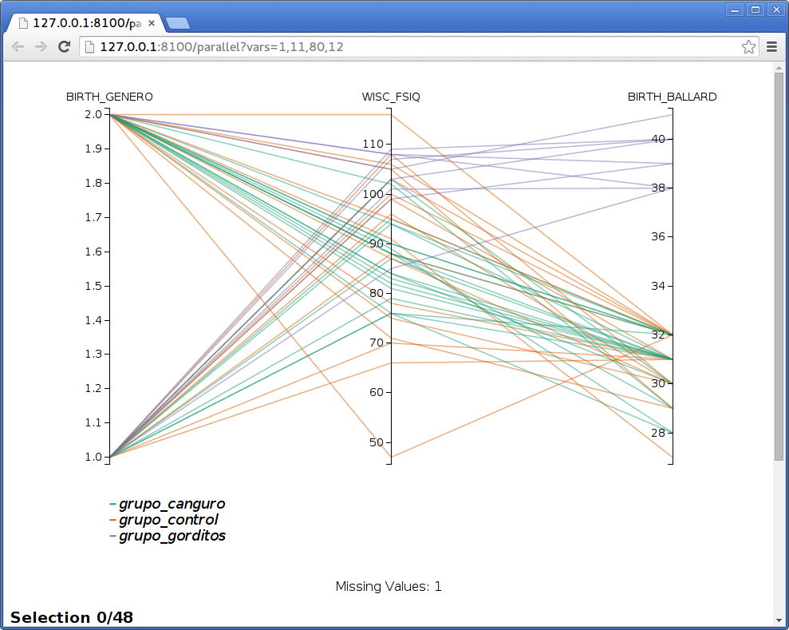
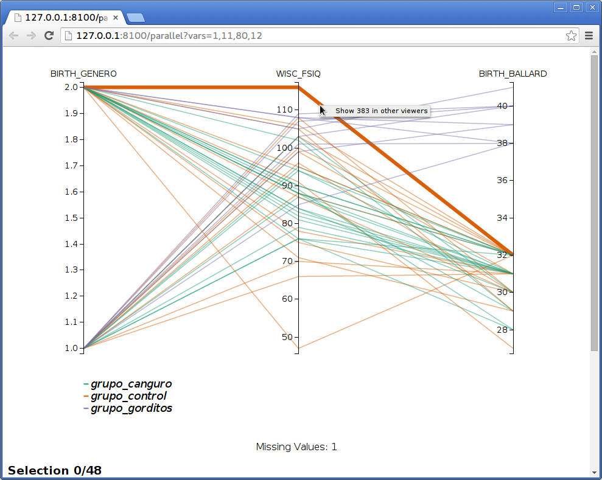
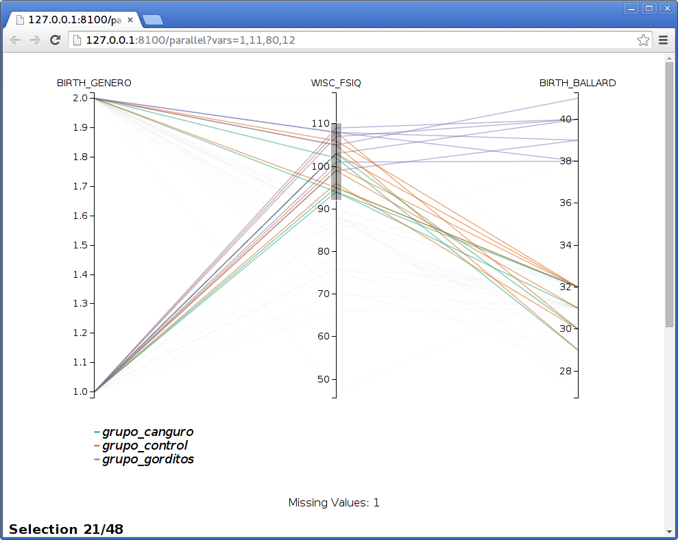
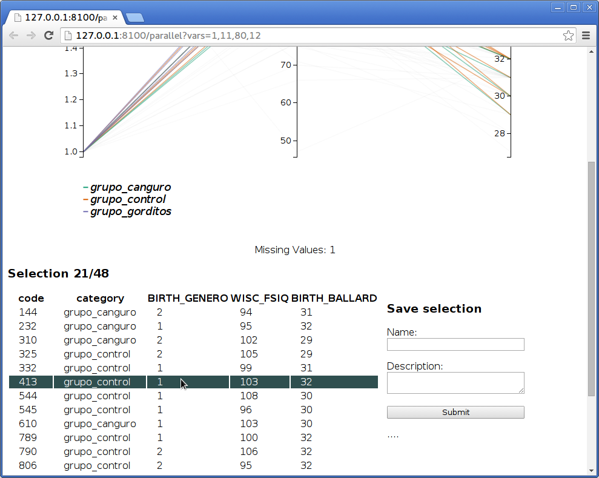

Parallel Coordinates
=====================

This application lets you explore variables using a parallel coordinates visualization. It uses a web visualization
and the results are best viewed in web browser. The main window contains two panels, at the left is a control panel
where you can select the variables you want in your visualization, and at the right is a web-view. The web-view
is a small web-browser. It is possible to preview the visualization in this integrated browser, but the interaction
is much more fluid in a full web browser (like google chrome, firefox or safari). In order to open the
parallel coordinates web page in your default browser click on the blue link over the web-view. You can also copy
the address and paste it in the address bar of a browser.

Notice that this visualization is based on this
`D3 example <http://mbostock.github.io/d3/talk/20111116/iris-parallel.html>`_.

Selecting Data
---------------

There are three pieces of data that make up the parallel coordinates view.

    -   **Sample** : Use the *sample* option from the *file* menu in order to select the set of subjects you
        want to display.
    -   **Cathegories** : Lines can be colored based on a nominal variable, use the box to select which one.
    -   **Variables** : You may add as many variables as you want to the visualization, each of them will be displayed
        as a new axis. Use the checkboxes in the list of the left to add or remove individual variables. Additionally
        you can use the *clear* button to remove all variables from the visualization.

Interacting with the visualization
------------------------------------

As previously mentioned the visualization works best on a full web browser. In order to open the visualization in your
default browser click on the blue link at the top right corner.

.. warning::
    Don't close the main application, the web browser still needs to communicate with it.

Identifying subjects
^^^^^^^^^^^^^^^^^^^^^

When you move the mouse over the line you will see that the line directly under the pointer will become thicker. When
the line that grabbed your attention becomes thicker, you can hold the mouse still, after a while the id of the
subject to whom the line belongs will appear. If you hold the mouse for even longer, a context menu will appear, giving
you the option to show that particular subject in all opened viewers.

Notice that this application also listens for messages from other applications, and will highlight subjects when
requested.

Reorganizing axes
^^^^^^^^^^^^^^^^^^

You can change the order in which axes are displayed. To do so, click on and axis title and hold the button,
you can then drag the axis around. When you let it go, all of the axes will redistribute again but the order will
be maintained.

Filtering data
^^^^^^^^^^^^^^^

You can filter data in order to select lines that cross an axis at certain intervals.

In order to do so click and hold on one of the axis then move to preview the interval and finally
release the button. You can filter on many axes simultaneously by drawing several intervals. Notice that the text
at the bottom of the page will update to show how many subjects are selected. If you scroll the window further down
you will see a table with the values for the selected subjects.

Saving sub-samples
^^^^^^^^^^^^^^^^^^^

After selecting a group of lines as explained above, you may save them into the database as a new subsample for the
whole system. This is done using the form shown at the right of the table of selection subjects. Write a name and
a description for the new sample and click on *submit*. If everything goes well you will see the message
*saved!* under the submit button.
