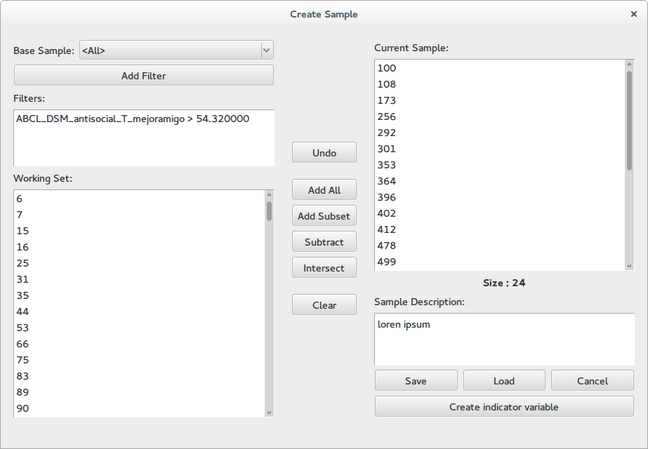

Creating Samples
==================

Most applications let you work with a smaller set of subjects so that you can better focus your analyzes.
To create such a list the *sample creation dialog*, which can be accessed by clicking *new* on all places
where you are prompted to select a sample. For example you may click on *subsamples* in the main menu and
afterwards click in new.

This dialog contains three columns. At the left a working space, at the right the current sample and in the middle
a series of bottoms for combining the two.

The working set
----------------

In this panel you apply filters to a base sample in order to get a reduced subset. To add a new filter click
the *Add Filter* button. This will take you to a variable select dialog where you can additionally select a threshold
for real variables or a set of valid labels for nominal variables. Only subjects that pass all the filters will
be shown at the bottom list. To remove a filter right click on it and select remove from the context menu.

Combing working and current sets
-------------------------------------

The buttons in the middle of the dialog allow you to move information from the working set to the current sample.

    -   **Undo**:   Restore the current sample to how it was before the last operation
    -   **Add All**:    Add the complete working set to the current sample
    -   **Add Subset**:    Add a random subset from the working set to the sample, a dialog will
        prompt you for the amount of subjects you which to add
    -   **Subtract**:    Remove the subjects in the working set from the sample
    -   **Intersect**:    Intersect the current sample with the working set, only subjects who appear in the
        working set will be kept in the sample.
    -   **Clear**:    Clear the current sample

Additionally you can right click on any subject in the working set and from the context menu add him to the
current sample. You can also right click on individual subjects in the current sample and remove them from
the context menu.

The current sample
--------------------

The right panel shows the subjects in the current sample and its size. Afterwards there is a field where you can
write a description for the sample. It is useful to describe which operations you applied in order to generate
the sample, or what is its intend.

Use the *save* button to save the sample into the database, it will prompt you for a name and allow you to review
the description. The *load* button loads a set of subjects into the current sample list. The *cancel* button closes
the dialog and discards the sample.
Finally, the create indicator value allows you to create a nominal variable, which has label 1 for subjects in the
sample, and 0 for subjects outside the sample.