Subject Overview
==================

.. image:: images/subj_overview.png
    :align: center
    :width: 90%
    :alt: Subject overview screenshot

This is the largest application in the braviz systems. It provides access to several kinds of neuro-image based data
for a single subject in the same view. The kind of data and visualization parameters can be configured using individual
controls. Afterwards it is possible to cycle through the subjects keeping this parameters constant.

This application sends a message to the rest of the system when the current subject changes. It also listens for
messages indicating a subject change, and when it receives one switches to that subject. If you want to avoid that
behaviour, press the keychain button at the right side of the subject widget.

Most of the application interface is occupied by a 3d viewer (see :doc:`3dviews`). At the left side is the control
panel, where the graphical attributes for the different data types can be set. This panel includes tabs for controling
the list of available subjects, and for showing additional details.  At the lower left is a small panel for changing
the coordinate system (see :doc:`concepts`) and for resetting the camera to pre defined locations.

Under the main 3d viewer is a widget that displays the current subject and allows you to change it, and at the
very bottom is a *context panel* which provides values for certain variables for the current subject.

.. hint::
    The control panel, context panel, and the subject widget can be hidden in order to provide more room
    for the 3d view. Move the mouse to their border until you get
    a cursor with two arrows, then click and drag to hide (or enlarge) these panels.

Changing subjects
-------------------

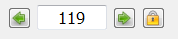

This widget displays the current subject and lets you change it. The arrow buttons can be used to select the
previous and next subjects based on the list shown in the *Subjects tab* of the control panel. You can also click
on the text area and write the id of a subject using the keyboard. Notice a message will be broad-casted to all other
applications indicating the new subject.

The keychain button allows you to lock the current subject. In the locked status it will become impossible to change
the current subject, neither by using the other controls in this widget nor by messages from other applications.

.. hint::
    You can also use the left and right arrow keys in the keyboard to change subjects.

The context panel
------------------

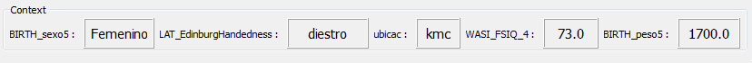

The context panel displays the values of some variables for the current subject. It is meant to provide additional
information about the subject useful when interpreting the images. At the start the variables shown are those
found in the configuration file (see :doc:`configuration`), but you may choose the ones that are more important
for the actual analysis. In order to do that right click inside the panel and from the context menu select
*change variables*. A dialog for selecting variables will appear. This dialog includes a secondary table at the
bottom left containing the actual variables. From this dialog you may also create a new variable and
optionally give it initial values. The current variables table has a column indicating the variable type and a
check-box indicating if it should be possible to modify the variable value from the panel.
A panel with editable variables will look like this

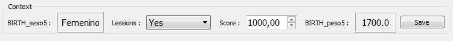

In this case you may modify the variable values based on your observations of the image. Values are only saved
into the database after clicking on the *Save* button.

The view panel
---------------

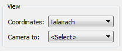

This panel has two functions. First it lets you select the coordinate system used in the 3d viewer. Second, it allows
you to reset the camera to a predefined position. Using *Talairach* or *Dartel* coordinates will make it easier to
compare different subjects, but it will add some distortion to the objects in the viewer.

The control panel
------------------

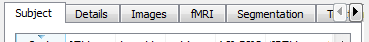

The control panel houses the controls for adding, removing, and modifying visual properties of the objects in the
viewer. It also lets you modify the order in which subjects are traversed and the current subsample. Finally it lets
you see additional details of the current subject. All of these features are available under different tabs.

Subject tab
^^^^^^^^^^^^

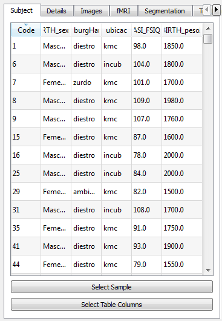

This tab shows a table with the subjects in the current sample. By default they are ordered by code, but you can
click on the header of any column to change the order. The *select sample* button allows you to select a subsample
of subjects to use in the application. By pressing the *select table columns* button will open a dialog where you
can select which variables you want to be displayed as columns in the table. If you double click on any of the rows
of the table the application will switch to that subject. Finally, notice that the order in which subjects are
traversed using the *subject selection widget* is determined by this table.

Details tab
^^^^^^^^^^^^

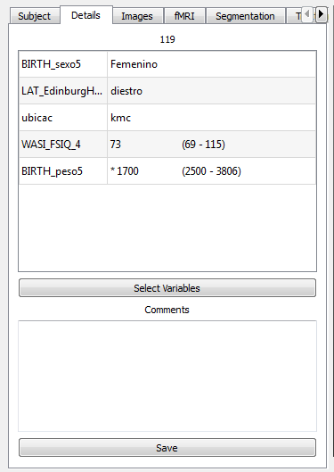

This tab lets you view additional variable values for the current subject. In this case each variable is displayed
as a row in the table with the value in front. For real variables the minimum and maximum values found inside the
reference population (see :doc:`configuration`). A star is shown next to the values that fall outside this range.
Clicking the *select variables* button will display a dialog where you can select the variables that will be used as
rows for the table.

.. hint::
    You may change the order of the rows by dragging them with the mouse.

At the bottom of the tab is a large text field where you can write general comments about the subject. This comments
will be saved into the database when you click on *save*. The next time you open the same subject the previously
entered comments will show again. You can use this to register remarks or peculiarities about a subject that should
be taken into account when looking at him.

Images tab
^^^^^^^^^^^^

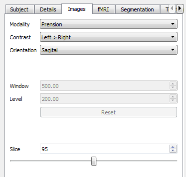

Here you can control the image shown in the main view, or switch it off. The *modality* field is where you select the
kind of image you want to see. Available options include anatomical MRI, color DTI, FA, freesurfer *APARC* segmentation
and fMRI paradigms. In case you choose an fMRI paradigm the second field, labeled *Contrast* will become active. You
can then use it to select the contrast of interest.
The orientation box lets you select the orientation of the image plane.

In some kinds of images you can manipulate the window and level values from the lookup-table using the corresponding
fields. Notices you can achieve the same effect by right clicking and dragging the mouse on top of the image in the
3d view. The *Reset* button can be used to reinitialize the window and level values.

Finally the slice field and slider display the current slice and allows you to move it.

.. hint::
    You can use the mouse wheel to change slice while the cursor is on top of the slider or the slice number field.
    You can also use the top and down arrows in the keyboard when the cursor is on the slice number field.

fMRI tab
^^^^^^^^^^^^

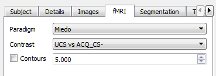

This tab allows you to display iso-contours of fMRI statistical maps. The *paradigm* and *contrast* fields are used
to select the map of interest. The *contours* checkbox activates or deactivates the contours, and the value in front
is the T-score value at which you want to show contours. The color of the contours will be the color used for that
value in the fMRI lookup-table.

Segmentation tab
^^^^^^^^^^^^^^^^^^

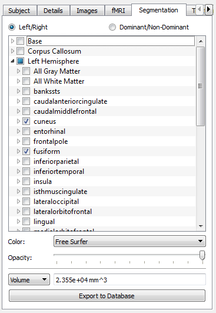

With the controls on this tab you can include segmented structures in the 3d-view. This structures can also be used
to select fiber bundles that go through them later in the *Tractography tab*.

Most of the space is occupied by a tree which represents all of the free-surfer segmented structures. Next to each
item is a checkbox that activates or deactivates the given item and its descendants. The tree is divided into the
following sections

    -   **Base**: Subcortical structures
    -   **Corpus Callosum**: The five sections segmented by freesurfer
    -   **Left Hemisphere**: Cortical parcellation of the left hemisphere
    -   **Right Hemisphere**: Cortical parcellation of the right hemisphere

Notice that the cortical parcellations can alternatively be split into *Dominant* and *Non-dominant* using the
radio buttons at the top of the frame.

Below the list is a combo-box that lets you choose between using the freesurfer lookup-table for coloring the structures,
or choosing your own color. Underneath is a slider that lets you adjust the transparency of the structures.

Finally, the bottom section of the frame, displays a combo-box where you can select an scalar measure. The value of
the given measure for the active structures will be shown in front. Currently the available measures are

    -   **Volume**: Sum of the volumes of all the active structures
    -   **Area**: Sum of the surface areas of the active structures
    -   **FA Inside**: Mean FA value from the voxels that lay inside the active structures
    -   **MD Inside**: Mean MD value from the voxels that lay inside the active structures

The button labeled *Export to Database* allows you to repeat the calculation for all subjects, and save the results
as a new variable into the database.

Tractography tab
^^^^^^^^^^^^^^^^^^

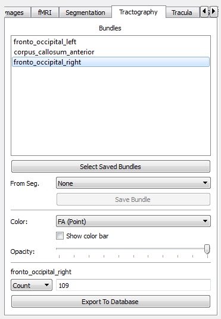

In this tab you can select fiber bundles to display in the 3d view. The top part shows a list of currently active
bundles. In order to add bundles to the list click on the button *Select Saved Bundles*. These bundles are stored
into the database and can come from three places:

    -   They can be created in this tab based on segmented structures (read below)
    -   They can be created in the Logic Bundles application (see :doc:`logic_bundles`)
    -   They can be defined using code (Advanced, see :mod:`~braviz.readAndFilter.named_tracts`)

The combo box labeled *From Seg.* lets you build new bundles on the fly based on the currently active structures from
the *Segmentation tab*. The possible values for the box are

    -   **None**: Don't create a bundle from segmented structures
    -   **Through Any**: Create a bundle with fibers that pass through any of the active structures
    -   **Through All**: Create a bundle with fibers that pass through all of the active structures.

The *Save Bundle* button under the box lets you save the bundle defined by the operation and the list of segmented
structures into the database. This bundle will be later available by clicking the *Select Saved Bundles* button.

The box labeled *color* is used to select the lookup-table to use for displaying fibers in the viewer. The available
values are:

    -   **Orientation**:    Color the lines based on the direction in which they travel. Red segments are going from
        lef to right or right to left, green segments are going from front to back or back to front, and blue segments
        are going from top to bottom or bottom to top.
    -   **FA (Point)**: Each segment is colored according to the FA value at that voxel
    -   **FA (Line)**: Each line is colored according to the mean FA value in all its trajectory
    -   **MD (Point)**: Each segment is colored according to the MD value at that voxel
    -   **MD (Line)**: Each line is colored according to the mean MD value in all its trajectory
    -   **Length**: Each line is colored according to its length
    -   **By Line**: Each line is assigned a random color, useful for following individual lines
    -   **By Bundle**: Each bundle is assigned a different color, useful when multiple bundles are in the scene

For the color schemes that are based on scalar values, the *show color bar* check box will be activated, and checking
it will display a color bar that illustrates the mapping from scalar values to colors in the screen.

The opacity slider lets you make the bundles translucent so that you can see what is behind.

The last section of the panel displays an scalar value from one of the active bundles. In order to change the active
bundle you must click on its name in the list at the top of the panel. The currently available scalar values are:

    -   **Count**: Number of lines that make up the bundle
    -   **Mean L**: Mean length of lines in the bundle
    -   **Mean FA**: Mean FA from all points in the bundle
    -   **Mean MD**: Mean MD from all points in the bundle

The *Export To Database* button lets you calculate the same scalar for all subjects and save it as a new variable in
the database.

Tracula tab
^^^^^^^^^^^^^^^^^^

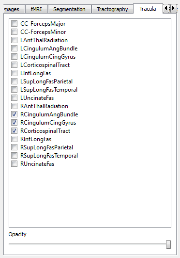

This tab allows you to display bundles from tracula tractography. It displays a list of such bundles where you can
check the ones you want to display. At the bottom there is an slider for controlling opacity of the bundles, lowering
it will allow you to see through them.

Surfaces tab
^^^^^^^^^^^^^^^^^^

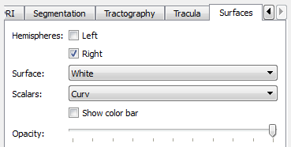

The surfaces tab provides access to freesurfer surface reconstructions. First there are two check boxes which let
you activate or deactivate each hemisphere. Afterwards there is a combobox where you can select the surface you
want to see, in this application the selection is limited to *pial* and *white*. Afterwards there is another combobox
labeled *scalars* which lets you select the scalars and lookuptable that will be displayed. The current options are

    -   **Curv**: Curvature at each point
    -   **Avg. Curv**: Smoothed curvature map
    -   **Thickness**: Thickness of the cortex at the point
    -   **Sulc**: Height of each point with respect to the average surface (`source link <http://surfer.nmr.mgh.harvard.edu/fswiki/UserContributions/FAQ#Q.IamusingQDECtoexaminetheanatomicaldifferencesbetweentwogroupsofsubjects.Thesurface-basedmeasuresIcanselectarethickness.2Carea.2Carea.pial.2Csulc.2Ccurv.2Candjacobianwhite.Couldanybodytellmewhatanatomicalfeaturesthelaterthree.28sulc.2Ccurv.2Candjacobianwhite.29actuallymeasure.3F>`_)
    -   **Parcellation**: Parcelation based on Desikan-Killiany Atlas
    -   **Parcellation 2009**: Parcelation based on Destrieux Atlas
    -   **Parcellation DKT**: Parcelation based on DKT atlas
    -   **Broadman area**: Parcelation based on broadman areas (only a few regions)

For more information on freesurfer parcelations see `here <https://surfer.nmr.mgh.harvard.edu/fswiki/CorticalParcellation>`_

The *show color bar* check box is activated for color schemes showing scalar values, you may click on it to show
a color bar with the mapping from scalar values to colors.

.. hint::
    You may click and hold on a surface in order to query the value or label at any point.

Finally the opacity slider lets you add some transparency to the surfaces so that they don't occlude the scene.

Scenarios
------------

As seen above there are several ways in which you can configure this application for specific tasks. Setting up a
visualization may take a significant amount of time and effort. To avoid having to repeat the work, it is always a
good idea to save the application state often.

Application state is saved as a scenario. This scenarios include everything, from the active objects in the 3d
view to the camera position.

In order to save a scenario click on the *file* menu in the top bar, and afterwards *save scenario*. You will be
asked to provide a name and optionally a description.

To load a scenario go to the *file* menu and click on *load scenario*. A dialog containing the available scenarios will
open. This dilog contains the date in which scenarios were saved, the name and the description. They also show a
screenshot of the application taken at the moment the scenario was saved. To select a scenario double click on its name
and afterwards on the *ok* button.

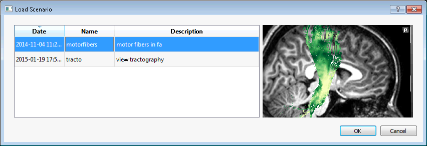
