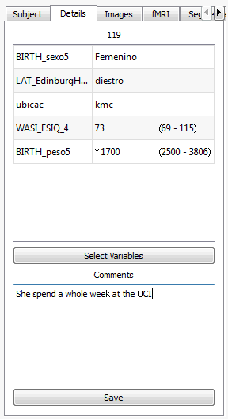

Subject Overview
==================

.. image:: images/subj_overview.png
    :align: center
    :width: 90%
    :alt: Subject overview screenshot

Changing subjects
-------------------

.. image:: images/subject_overview/select_subject.png
    :align: center
    :alt: Subject selection widget

The context panel
------------------

.. image:: images/subject_overview/context.png
    :align: center
    :width: 90%
    :alt: Context panel

The view panel
---------------

The control panel
------------------

.. image:: images/subject_overview/control.png
    :align: center
    :width: 80%
    :alt: Control panel tabs

Subject tab
^^^^^^^^^^^^

.. image:: images/subject_overview/subject_tab.png
    :align: center
    :width: 50%
    :alt: Subject tab

Details tab
^^^^^^^^^^^^

Images tab
^^^^^^^^^^^^

.. image:: images/subject_overview/images_tab.png
    :align: center
    :width: 50%
    :alt: Images tab

fMRI tab
^^^^^^^^^^^^

Segmentation tab
^^^^^^^^^^^^^^^^^^

.. image:: images/subject_overview/subject_tab.png
    :align: center
    :width: 50%
    :alt: Subject tab

Tractography tab
^^^^^^^^^^^^^^^^^^

.. image:: images/subject_overview/tractography_tab.png
    :align: center
    :width: 50%
    :alt: Tractography tab

Tracula tab
^^^^^^^^^^^^^^^^^^

.. image:: images/subject_overview/tracula_tab.png
    :align: center
    :width: 50%
    :alt: Tracula tab

Surfaces tab
^^^^^^^^^^^^^^^^^^

.. image:: images/subject_overview/surfaces_tab.png
    :align: center
    :width: 50%
    :alt: Surfaces tab

Scenarios
------------

Saving and loading