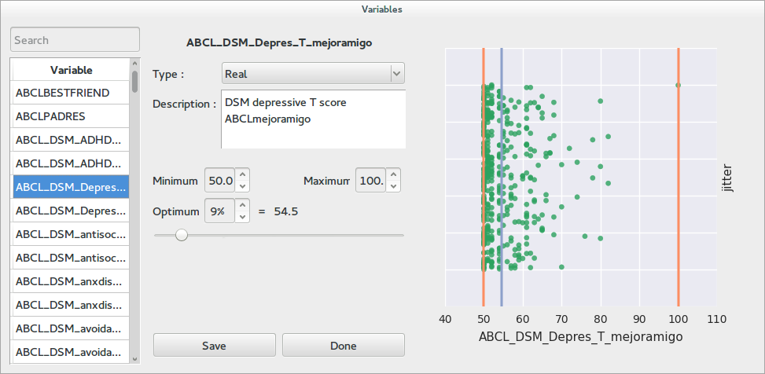
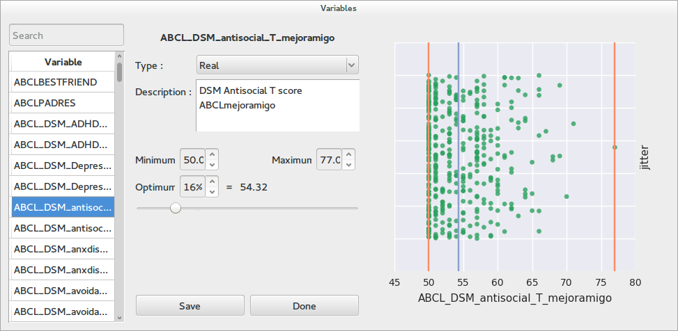
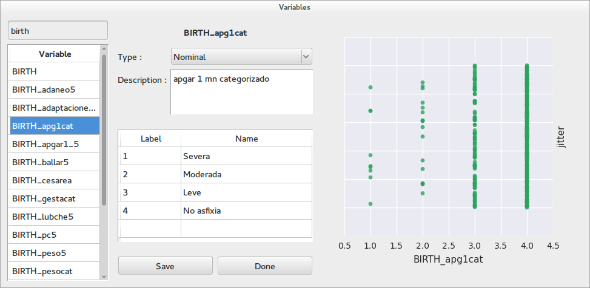
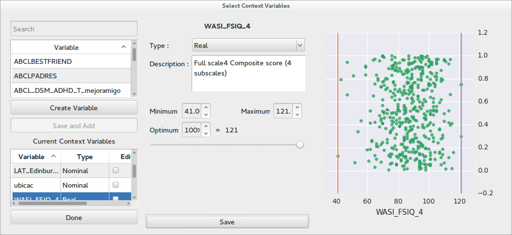
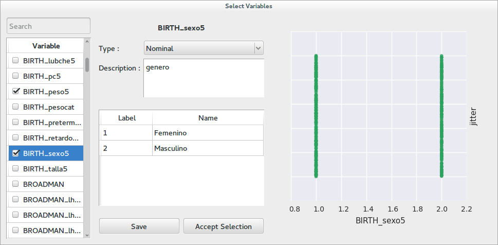

Working with variables
==========================

Most of Braviz applications will require that you select one or more variables. All of these operations are carried
out with a dialog similar to this one

As you can see the dialog contains three panels. At the very left there is a list of variables. In some cases
there will also be a list of selected variables at the bottom. At the top of the list there is a search box.
To look for a particular variable enter part of its name in this box and press enter. To select a variable you
must double click on it.

The middle panel contains meta-data about the variable. This panel should contain information about the current selection,
however with a new project most of this data will be incomplete. This panel lets you review the meta-data associated
to a certain variable and fill missing information.

The *type* field lets you select the type of the variable. Afterwards there is always a description, which should
provide a more detailed explanation on the meaning of the variable. The rest of the panel will behave different for nominal
or real variables. Read further down for additional details.

Finally the right panel shows the distribution of the variable. In most cases the *y-axis* is noise, and the *x-axis*
are values of the current variable. This can help you decide on the type of the variable you are looking at. Nominal
variables usually contain a limited number of values, while real variables can take a grand variety of values.

.. hint::
    You can also use the keyboard to navigate the lists and select variables

Real variables
---------------

The picture shows a real variable. It can be seen that the plot shows values all around the *x-axis*. In the middle
panel we get fields to enter the minimum value the variable can logically take, the maximum value, and the value that
it should optimally have. This values are also shown in the plot with red lines and a blue line for the optimum.

Nominal variables
------------------

In this dialog a nominal variable is selected. It can be seen that there are only 4 possible values in the plot. The
meta-data panel has a table in which text labels can be associated to the numerical labels of the variable.

Selecting one variable
-----------------------

In order to select a single variable, look for it on the list on the left and double click on it. Afterwards review
the meta-data information in the middle and possibly improve it. If all is correct click on *save and select*.
If you just want to update the information for a variable, but not select it, just click in *save* and continue
browsing the list.

Selecting multiple variables
----------------------------

There are two kinds of dialogs which allows you to select multiple variables.

In this type of dialogs there is a second list under the main variable list at the left panel. Variables are added
to the list by clicking the *save and add* button between the two lists. Variables are removed from the list by
right clicking on them and selecting remove (in the bottom list). You may also double-click on variables on the
bottom list to review its meta-data. Some times the bottom list is a actually a table which contains additional
information for the selected variables. When you are finished click on *done*.

In this simpler dialog, variables are selected and unselected by clicking on the checkboxes next to their names. When the selection
is complete click on *Accept Selection*.
