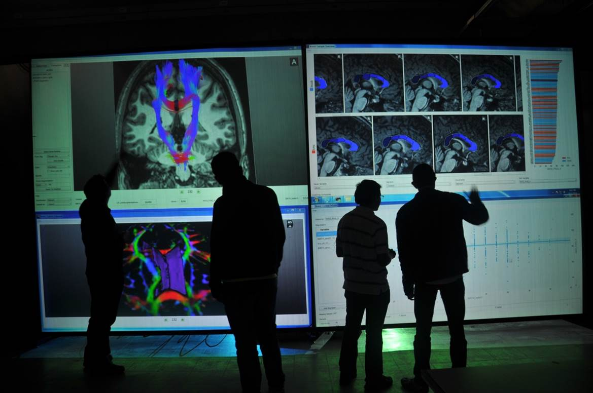

Braviz: Interactive brain data visualization
================================================

.. toctree::
    :includehidden:
    :maxdepth: 0
    :hidden:

    Graphical Interface <graphical/index>
    Library <library/index>

Braviz is both, a python library, and a system with a graphical user interface which
can be used to analyze brain data. To start select the point of view from which
you want to use Braviz below.

Profile
---------
Graphical Interface
^^^^^^^^^^^^^^^^^^^^^^^^^

    -   Instant access to your project's data
    -   Visualize neuro-image data in context of tabular data
    -   Perform basic statistical analyses
    -   Visualize distribution of variables
    -   Define your own variables based on neuro-image data

:doc:`Visual Analytics with Braviz (Click here)<graphical/index>`

Python Library
^^^^^^^^^^^^^^^^^^^^^^^

    -   Convenient access to neuro-image data
    -   Use scripts to perform additional processing
    -   Program new interactive visualizations
    -   Interactively build custom visualizations

:doc:`Braviz Library (Click here)<library/index>`

About
-------

.. container:: bravizvideo

        .. youtube:: http://www.youtube.com/watch?v=txcGeJd6gZw

Braviz is being developed at the `imagine <http://imagine.uniandes.edu.co>`_ research group
as part of a phd thesis. The objective is providing brain researchers with interactive
visualization tools, which will allow them to explore and grab insights from
large and heterogeneus data-sets more efficiently. The focus is on user centered design,
for heavy processing, calculations and visualization we rely when ever possible in
other libraries.

Acknowledgements
^^^^^^^^^^^^^^^^

Braviz would not have been possible without the kind contribution of the
`Kangaroo Foundation <http://www.fundacioncanguro.co>`_, whose experts contributed significant time in testing and
providing feedback to our applications. They also provided the initial data on which
all tests were carried.

I would also like to take some former members of the IMAGINE group who provided important help. Johana to who we owe
the name *Braviz*, Luis, Jaime, Darwin, Juan Camilo, Alejandro
and last but not least Diana to who we owe the very nice logo.

