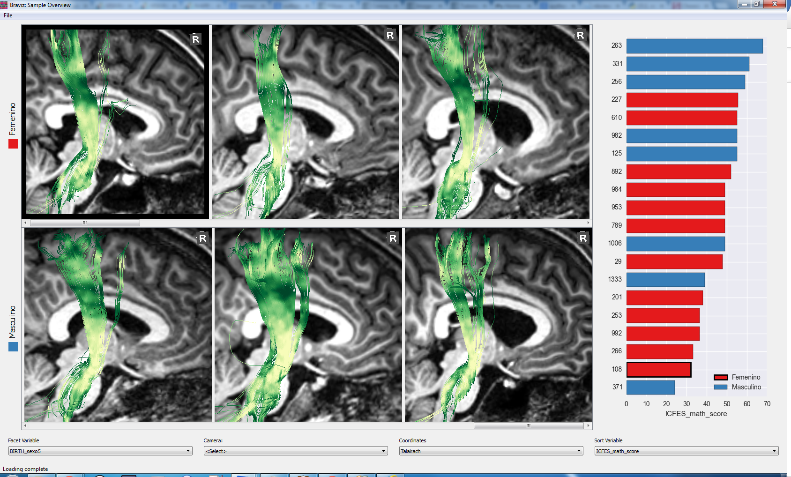
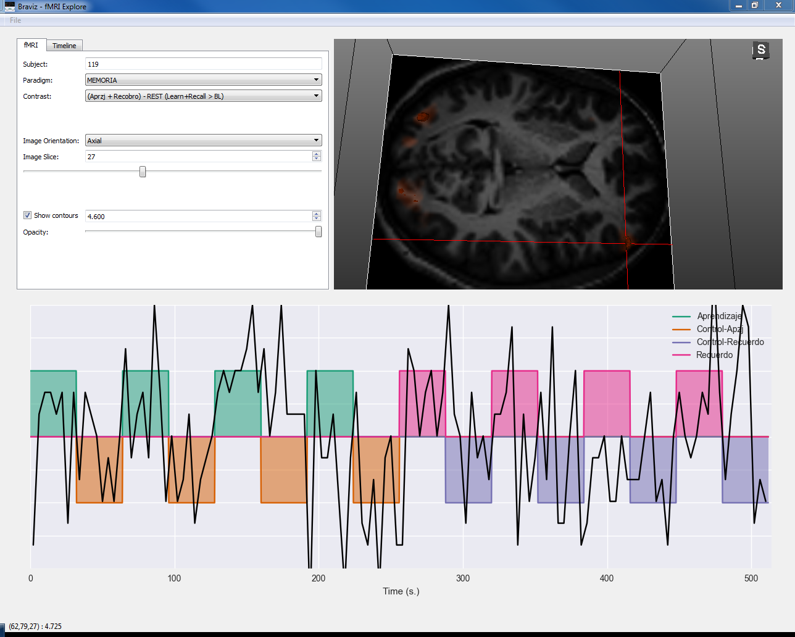
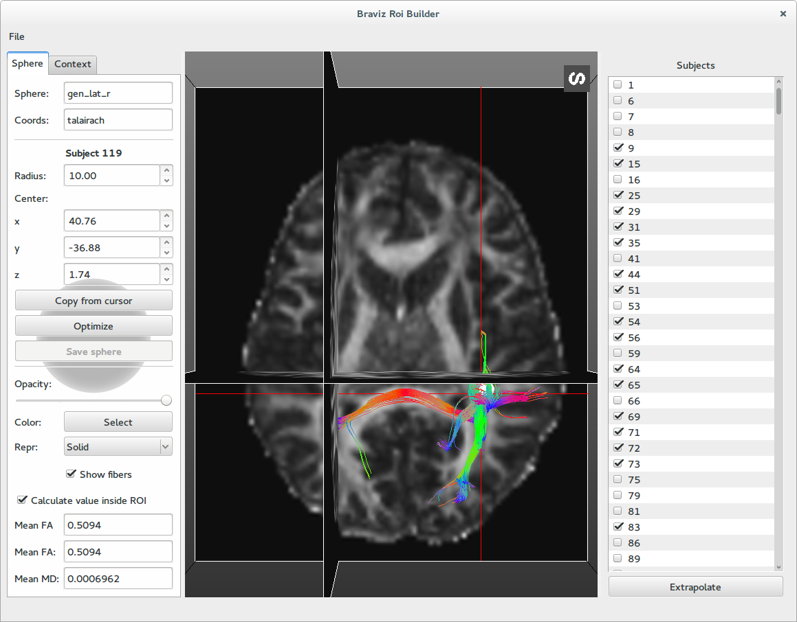
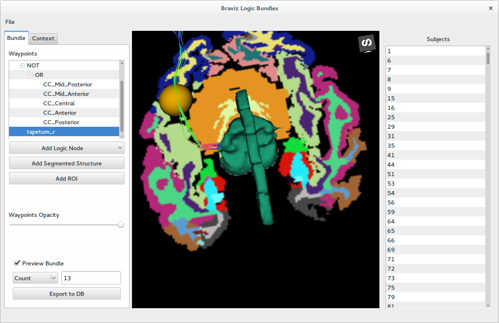
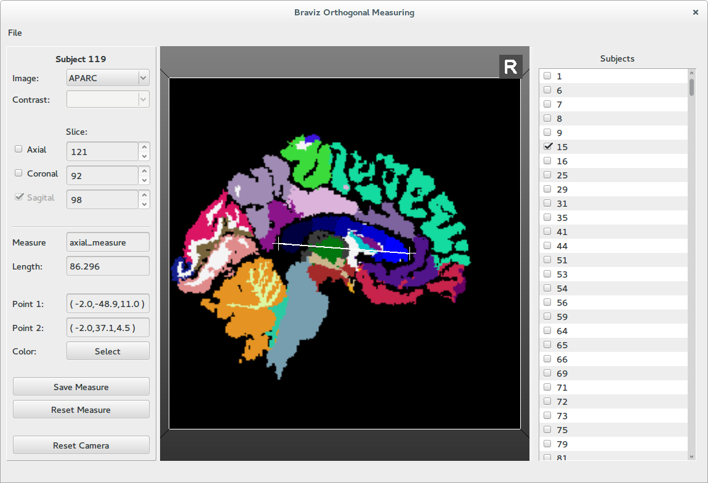
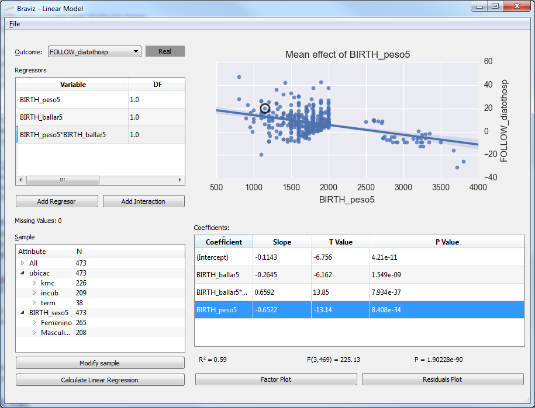

.. module:: braviz.applications

Applications
=============

The applications module is where all end-user applications live. Python files in this modules should be
executable. This module also contains the configuration files used in :mod:`braviz.readAndFilter.config_file`.

This page will contain an overview of the scripts located in this module and some guidelines on creating new
applications. For documentation from the user point of view please look at

:doc:`../graphical/applications`

.. module::braviz.applications.braviz_menu2

The braviz menu
----------------

The braviz menu is the main entry point for users. It provides an overview of the available tools and provides access
to them. But it also performs several important tasks on the background.

    - Check database integrity (see :doc:`braviz_db`)
    - Rebuild qt interfaces
    - Act as a message broker (see :doc:`communication`)

When an application icon is clicked in the menu, it spawns a new python interpreter with a command line similar to

.. code-block:: console

    python -m braviz.applications.<app_name> <scenario_id> <server_broadcast> <server_receive>

The parameters are

    - **app_name** : The application script
    - **scenario_id** : The id of the initial scenario to load in the application. It is 0 if called from the
      main icon, or the corresponding id if called from the *scenarios* dialog
    - **server_broadcast** : The address that will be used for broadcasting messages.
    - **server_receive** : The address in which the broker will receive messages

Notice that the broadcast and receive addresses will be printed when the server starts. You may use this addresses
to connect to the server from external applications.

For an overview of the menu from the user point of view see :doc:`../graphical/menu`

Graphical applications
------------------------

Visualize geometry
^^^^^^^^^^^^^^^^^^^^

.. module:: braviz.applications.subject_overview

Subject Overview
"""""""""""""""""

.. image:: images/subj_overview.png
    :alt: Subject overview screenshot
    :width: 80%
    :align: center

This application provides access to geometrical and tabular data from a single subject.

See :doc:`User documentation <../graphical/subject_overview>`.

.. ----------------------------------------------------------------------

.. module:: braviz.applications.sample_overview

Sample Overview
"""""""""""""""""

The sample_overview application can load geometric data for several subjects in the same display. Visualizations
are created as scenarios in the subject overview application. They are arranged in rows with respect to a nominal
variable and sorted from left to right with respect to a real variable.

See :doc:`User documentation <../graphical/sample_overview>`.

.. ----------------------------------------------------------------------

.. module:: braviz.applications.fmri_explorer

Explore fMRI
"""""""""""""""""

This application specializes in fMRI data. It shows a timeline with the experiment design and the raw bold signal at
the bottom.

See :doc:`User documentation <../graphical/fmri_explore>`.

.. ----------------------------------------------------------------------

.. module:: braviz.applications.check_reg_app

Check Registration
""""""""""""""""""""

.. image:: images/check_reg.png
    :alt: Check registration screenshot
    :width: 80%
    :align: center

This application allows to compare two images in order to check if a registration algorithm was successful or
to compare images from different subjects.

See :doc:`User documentation <../graphical/check_reg>`.

Create geometry
^^^^^^^^^^^^^^^^^^^^

.. ----------------------------------------------------------------------

.. module:: braviz.applications.build_roi

ROI Builder
""""""""""""""""""""

This application lets the user position spherical ROIs in the different subjects. Sphere positions and size can
be interpolated using one of the common spaces as intermediate stop. Images and cortical surfaces can be used as
guides to position the sphere. Fibers and scalar values inside the sphere are shown to the user.

See :doc:`User documentation <../graphical/build_roi>`.

.. ----------------------------------------------------------------------

.. module:: braviz.applications.logic_bundles

Logic bundles
""""""""""""""""""""

This application lets the user define new fiber bundles based on ROIs, segmented structures and logical
operations.

See :doc:`User documentation <../graphical/logic_bundles>`.

.. ----------------------------------------------------------------------

.. module:: braviz.applications.measure_task

Measure
""""""""""""""""""""

This application lets the user perform linear measurement over an orthogonal plane.

See :doc:`User documentation <../graphical/measure>`.

Statistics
^^^^^^^^^^^^^^^^^^^^^^^^^^^^

.. ----------------------------------------------------------------------

.. module:: braviz.applications.anova_task

Anova
""""""""""""""""""""

.. image:: images/anova.png
    :alt: Anova application screenshot
    :width: 80%
    :align: center

This application .................

See :doc:`User documentation <../graphical/anova>`.

.. ----------------------------------------------------------------------

.. module:: braviz.applications.lm_task

Linear Model
""""""""""""""""""""

This application

See :doc:`User documentation <../graphical/lm>`.

.. ----------------------------------------------------------------------

.. module:: braviz.applications.correlations

Correlations
""""""""""""""""""""

.. image:: images/correlations.png
    :alt: Correlations application screenshot
    :width: 80%
    :align: center

This application

See :doc:`User documentation <../graphical/measure>`.

.. ----------------------------------------------------------------------

.. module:: braviz.applications.parallel_coordinates

Parallel Coordinates
"""""""""""""""""""""

.. image:: images/parallel.png
    :alt: Parallel coordinates application screenshot
    :width: 80%
    :align: center

This application

See :doc:`User documentation <../graphical/parallel>`.

Command line applications
---------------------------

.. module:: braviz.applications.parse_spss_file

Parse spss files
^^^^^^^^^^^^^^^^^^^^^^^^^^^^

lalala

.. module:: braviz.applications.calculate_descriptors

Calculate descriptors
^^^^^^^^^^^^^^^^^^^^^^^^^^^^

lalala

.. module:: braviz.applications.populate_cache

Populate cache
^^^^^^^^^^^^^^^^^^^^^^^^^^^^

lalala

.. module:: braviz.applications.braviz_web_server

Braviz web server
^^^^^^^^^^^^^^^^^^^^^^^^^^^^

lalala