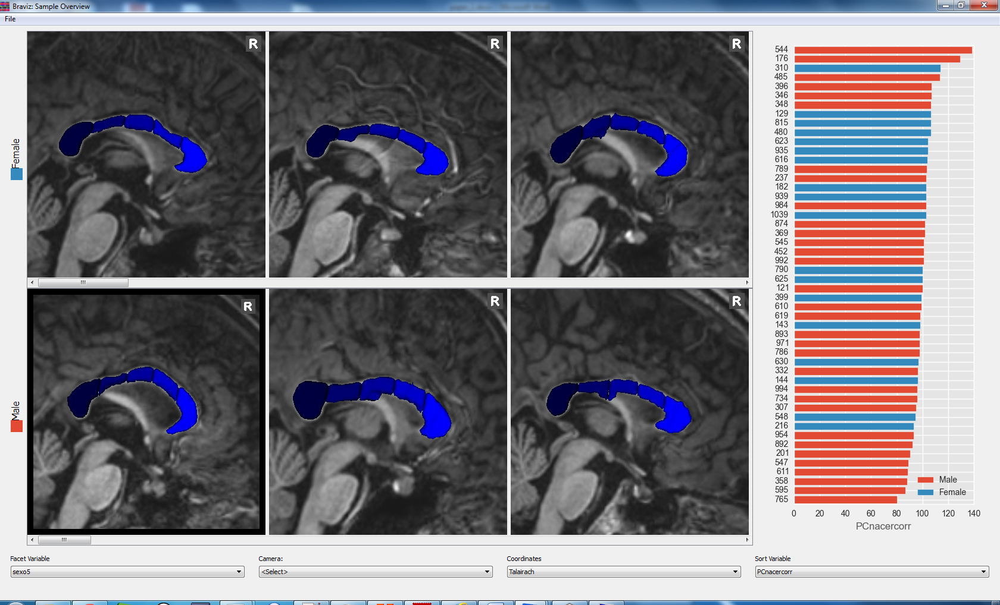
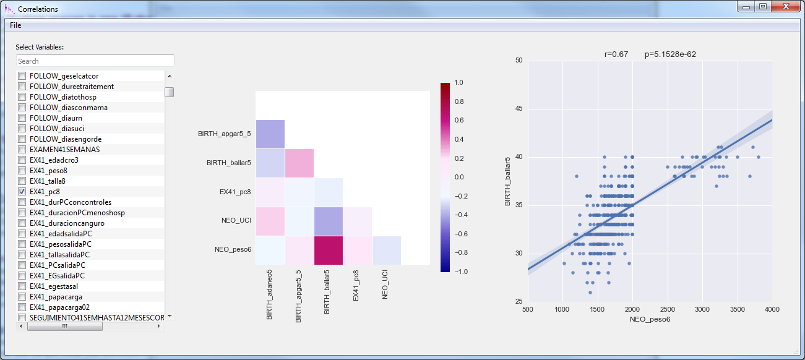

.. module:: braviz.applications

Applications
=============

The applications module is where all end-user applications live. Python files in this modules should be
executable. This module also contains the configuration files used in :mod:`braviz.readAndFilter.config_file`.

This page will contain an overview of the scripts located in this module and some guidelines on creating new
applications. For documentation from the user point of view please look at

:doc:`../graphical/index`

.. module::braviz.applications.braviz_menu2

The braviz menu
----------------

The braviz menu is the main entry point for users. It provides an overview of the available tools and provides access
to them. But it also performs several important tasks on the background.

    - Check database integrity (see :doc:`braviz_db`)
    - Rebuild qt interfaces
    - Act as a message broker (see :doc:`communication`)

When an application icon is clicked in the menu, it spawns a new python interpreter with a command line similar to

.. code-block:: console

    python -m braviz.applications.<app_name> <scenario_id> <server_broadcast> <server_receive>

The parameters are

    - **app_name** : The application script
    - **scenario_id** : The id of the initial scenario to load in the application. It is 0 if called from the
      main icon, or the corresponding id if called from the *scenarios* dialog
    - **server_broadcast** : The address that will be used for broadcasting messages.
    - **server_receive** : The address in which the broker will receive messages

Notice that the broadcast and receive addresses will be printed when the server starts. You may use this addresses
to connect to the server from external applications.

For an overview of the menu from the user point of view

see :doc:`../graphical/menu`

Graphical applications
------------------------

Visualize geometry
^^^^^^^^^^^^^^^^^^^^

.. module:: braviz.applications.subject_overview

Subject Overview
"""""""""""""""""

.. image:: ../graphical/images/subj_overview.png
    :alt: Subject overview screenshot
    :width: 80%
    :align: center

Visualize geometrical data from a single subject with tabular data as context.

See :doc:`User documentation <../graphical/subject_overview>`.

.. ----------------------------------------------------------------------

.. module:: braviz.applications.sample_overview

Sample Overview
"""""""""""""""""

The sample_overview application can load geometric data for several subjects in the same display. Visualizations
are created as scenarios in the subject overview application. They are arranged in rows with respect to a nominal
variable and sorted from left to right with respect to a real variable.

See :doc:`User documentation <../graphical/sample_overview>`.

.. ----------------------------------------------------------------------

.. module:: braviz.applications.fmri_explorer

Explore fMRI
"""""""""""""""""

.. image:: ../graphical/images/fmri_explore.png
    :alt: Explore fmri screenshot
    :width: 80%
    :align: center

This application specializes in fMRI data. It shows a timeline with the experiment design and the raw bold signal at
the bottom.

See :doc:`User documentation <../graphical/fmri_explore>`.

.. ----------------------------------------------------------------------

.. module:: braviz.applications.check_reg_app

Check Registration
""""""""""""""""""""

.. image:: ../graphical/images/check_reg.png
    :alt: Check registration screenshot
    :width: 80%
    :align: center

Compare two images in order to check if a registration algorithm was successful or
to compare images from different subjects.

See :doc:`User documentation <../graphical/check_reg>`.

Create geometry
^^^^^^^^^^^^^^^^^^^^

.. ----------------------------------------------------------------------

.. module:: braviz.applications.build_roi

ROI Builder
""""""""""""""""""""

.. image:: ../graphical/images/roi_builder.png
    :alt: Roi builder screenshot
    :width: 80%
    :align: center

Position spherical ROIs in the different subjects. Sphere positions and size can
be interpolated using one of the common spaces as intermediate stop. Images and cortical surfaces can be used as
guides to position the sphere. Fibers and scalar values inside the sphere are shown to the user.

See :doc:`User documentation <../graphical/build_roi>`.

.. ----------------------------------------------------------------------

.. module:: braviz.applications.logic_bundles

Logic bundles
""""""""""""""""""""

.. image:: ../graphical/images/logic_bundles.png
    :alt: Logic bundles screenshot
    :width: 80%
    :align: center

Define new fiber bundles based on ROIs, segmented structures and logical
operations.

See :doc:`User documentation <../graphical/logic_bundles>`.

.. ----------------------------------------------------------------------

.. module:: braviz.applications.measure_task

Measure
""""""""""""""""""""

.. image:: ../graphical/images/measure.png
    :alt: Measure application screenshot
    :width: 80%
    :align: center

Perform linear measurement over an orthogonal plane.

See :doc:`User documentation <../graphical/measure>`.

Statistics
^^^^^^^^^^^^^^^^^^^^^^^^^^^^

.. ----------------------------------------------------------------------

.. module:: braviz.applications.anova_task

Anova
""""""""""""""""""""

.. image:: ../graphical/images/anova.png
    :alt: Anova application screenshot
    :width: 80%
    :align: center

Fit anova regressions, and visualize the results, based on the
variables in the database. It uses `rpy2 <rpy.sourceforge.net>`_ to connect with the R statistical
software where the actual calculation takes place.

See :doc:`User documentation <../graphical/anova>`.

.. ----------------------------------------------------------------------

.. module:: braviz.applications.lm_task

Linear Model
""""""""""""""""""""

.. image:: ../graphical/images/linear_model.png
    :alt: Linear model application screenshot
    :width: 80%
    :align: center

Fit linear models and visualize the results, with the database variables.
Variable normalization and model fitting are done in R via  `rpy2 <rpy.sourceforge.net>`_.

See :doc:`User documentation <../graphical/lm>`.

.. ----------------------------------------------------------------------

.. module:: braviz.applications.correlations

Correlations
""""""""""""""""""""

Explore a dataset looking for potential correlations.

See :doc:`User documentation <../graphical/correlations>`.

.. ----------------------------------------------------------------------

.. module:: braviz.applications.parallel_coordinates

Parallel Coordinates
"""""""""""""""""""""

.. image:: ../graphical/images/parallel.png
    :alt: Parallel coordinates application screenshot
    :width: 80%
    :align: center

Explore relationships among several variables using a parralel coordinates display.

See :doc:`User documentation <../graphical/parallel>`.

Utilities
^^^^^^^^^^

.. module:: import_from_excel

Import from excel
""""""""""""""""""

Import variables from an excel file into the database

See :doc:`User documentation <../graphical/from_excel>`.

.. module:: export_vars

Export to csv
""""""""""""""""""

Export variables from the database into a csv file

See :doc:`User documentation <../graphical/export_csv>`.

.. module:: qt_sample_select_dialog

Sample select dialog
"""""""""""""""""""""

Select sub-samples and crate new sub-samples.

See :doc:`User documentation <../graphical/samples>`.

Command line applications
---------------------------

.. module:: braviz.applications.parse_spss_file

Parse spss files
^^^^^^^^^^^^^^^^^^^^^^^^^^^^

Access a spss ``*.sav`` file to read variables and metadata, specifically

    - variable descriptions
    - variable types
    - nominal variable labels
    - numerical variable values
    - textual variable values

To see help on this command, call it with the ``-h`` flag.

.. code-block:: console

    usage: parse_spss_file.py [-h] [-d] [-m] [-c] [-s] [-v] spss_file index_col

    Import data from spss files

    positional arguments:
      spss_file       Path to a spss file (usually with .sav extension)
      index_col       Variable containing subject indices

    optional arguments:
      -h, --help      show this help message and exit
      -d, --data      Read numerical data
      -m, --meta      Read variable descriptions, type, and labels for nominal
                      variables
      -c, --comments  Read text variables as comments for each subject
      -s, --save      Add the read information to the database
      -v, --verbose   Print data to the terminal

.. warning:: Using the ``-s`` will overwrite existing values in the database

.. module:: braviz.applications.calculate_descriptors

Calculate descriptors
^^^^^^^^^^^^^^^^^^^^^^^^^^^^

Calculate geometric descriptors from segmented structures (ASEG only) in all available subjects.
The results are saved into a database called ``descriptors.sqlite`` in the dynamic data root
(see :mod:`braviz.readAndFilter`). The geometric descriptors are

 -  Volume
 -  Surface Area
 -  Length of longest axis
 -  Length of second longest axis
 -  Length of third longest axis

All three axes are orthogonal. The output database contains a single table called "descriptors" with
columns: subject, structure, volume, area, d1, d2 and d3.

The application takes as argument the number of processes to use in the calculation, for example to
split the job on 4 processes use

.. code-block:: console

    python -m braviz.applications.calculate_descriptors 4

.. module:: braviz.applications.populate_cache

Populate cache
^^^^^^^^^^^^^^^^^^^^^^^^^^^^

Fill the braviz disk cache (see :mod:`braviz.readAndFilter.cache`) with commonly used data.
The script takes as argument the number of processes to use. For example, to use 3 processes
call it like

.. code-block:: console

    python -m braviz.applications.calculate_descriptors 3

.. module:: braviz.applications.braviz_web_server

Braviz web server
^^^^^^^^^^^^^^^^^^^^^^^^^^^^

Launches the `Tornado <tornado.readthedocs.org>`_ web server. It will listen for http requests on port 8100.

Notice that D3 visualization applications like :mod:`~braviz.applications.parallel_coordinates` will attempt
to launch the server process if it is not found. It should not be required to launch it manually.

The server is capable or relying braviz communication messages (see :doc:`communication`) to
web applications.

For compatibility it takes the same arguments as the applications launched from the menu, but ignores the scenario
argument.

.. module:: braviz.applications.import_comments

Import comments
^^^^^^^^^^^^^^^^^^^^^^^^^^^^

Reads textual comments from an excel table and uploads them to the subject comment (see :doc:`user_data`) field
of the data base.
