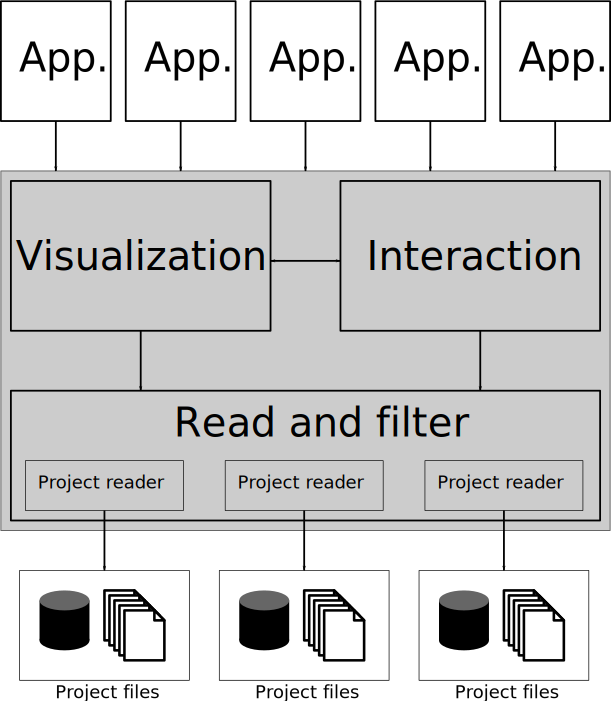

.. Braviz documentation master file, created by
   sphinx-quickstart2 on Fri Dec 26 10:02:29 2014.
   You can adapt this file completely to your liking, but it should at least
   contain the root `toctree` directive.

Braviz library
========================================

Introduction
-------------

The braviz library aims to simplify the creation of visual analysis tools for brain data. It abstracts common tasks
required in such tools so that developers can focus on providing appropriate interfaces and visualizations for a
given task.

The library is organized into the following modules

.. toctree::
    :includehidden:
    :maxdepth: 2

    read_and_filter
    visualization
    interaction
    applications

The :doc:`read_and_filter` module simplifies reading and manipulating geometric and tabular data.
The :doc:`visualization` module provides common geometric and spatial data visualization.
Finally the :doc:`interaction` module contains tools for creating user interfaces, and common functions found in
visual analysis tasks.

Using braviz it is possible to create graphical applications targeted at domain experts, which can be easily extended
to new data. In order to adapt the system to a new data-set a new :class:`~braviz.readAndFilter.base_reader.BaseReader`
subclass should be created. This class will be the only one that deals with the underlying file-system which contains
the project's geometric data. Once this class is ready, all of the already built applications will work with the new
data-set.

Geometric and Tabular Data
---------------------------

Geometric data is what is usually found in *scientific visualization*. It has coordinates which maps places in the real
world. In brain studies it usually  captured with an MRI machine and processed using several tools. Specifically
the current version deals with

- Structural MRI images
- DWI Images
- Tractography
- fMRI
- Segmentations and reconstructions
- Affine transforms
- Nonlinear warps

The :class:`~braviz.readAndFilter.base_reader.BaseReader` class provides a convenient way of accessing this data for
the different subjects in the study, automatically applying the necessary geometrical transformations.

Tabular data is commonly found in statistics and *infoviz*. It can be easily stored in tables and databases. In brain
studies it can be demographic and clinical information as well as results in neuro-psychological tests or other
performance indicators.

Usually both kinds of data are analyzed and manipulated with different tools. Braviz attempts to integrate them so that
patterns and relationships involving function and structure of the brain can be found.

Code Samples
------------

.. literalinclude:: examples/vtk_minimal.py

The code above displays the fibers that cross the anterior part of the  corpus-callosum of subject `119` together with its structural
MRI Image, in the Talairach coordinate systems. It produces the following output in a vtkWindow

.. image:: images/vtk_minimal.png
    :alt: example output
    :width: 80%
    :align: center

.. literalinclude:: examples/tabular_minimal.py

The code above reads two variables from the database, creates a scatter plot and highlights the position of subject `119`.

This two pieces of code provide the most simple way of combining tabular and geometrical data. For more advanced
examples look at gui user manual.

Guides
--------

The following guides are meant to help you find your way around the API and see how the different components can
be connected.

Adapting to a new project
^^^^^^^^^^^^^^^^^^^^^^^^^^^^^^

Configuring braviz to work with a new dataset.

:doc:`new_data_set`

Interactive work and simple scripts
^^^^^^^^^^^^^^^^^^^^^^^^^^^^^^^^^^^^

Using braviz from a python terminal and creating simple scripts.

[Not yet available]

Creating a new Qt Application
^^^^^^^^^^^^^^^^^^^^^^^^^^^^^^

Building a new Qt Application and integrating it with the rest of the system.

[Not yet available]

Creating a new Web Application
^^^^^^^^^^^^^^^^^^^^^^^^^^^^^^

Implementing a web visualization based on D3.

[Not yet available]

Dependencies
--------------

The focus of Braviz is providing useful interactive visualizations for domain experts. As such it can be considered
a high level library, focusing on the end user. For calculations, processing, data access and visualization;
it relies in the following projects

- `matplotlib <http://matplotlib.org/>`_
- `nibabel <http://nipy.org/nibabel/>`_
- `numpy <http://www.numpy.org/>`_
- `pandas <http://pandas.pydata.org/>`_
- `psutil <https://pypi.python.org/pypi/psutil>`_
- `PyQt4 <http://www.riverbankcomputing.co.uk/software/pyqt/intro>`_
- `rpy2 <http://rpy.sourceforge.net/>`_
- `scipy <http://www.scipy.org/>`_
- `seaborn <http://stanford.edu/~mwaskom/software/seaborn/>`_
- `tornado <http://www.tornadoweb.org/en/stable/>`_
- `vtk <http://vtk.org/>`_

Thanks a lot to all for making braviz possible.

Contributing
--------------

Issues
^^^^^^^^^

Please report bugs, issues and ideas for improvements in the
`issue tracker <https://bitbucket.org/dieg0020/braviz/issues>`_

Repository
^^^^^^^^^^

You may find the source code and propose improvements at the
`mercurial repository <https://bitbucket.org/dieg0020/braviz>`_

Indices and tables
==================

* :ref:`genindex`
* :ref:`modindex`
* :ref:`search`

