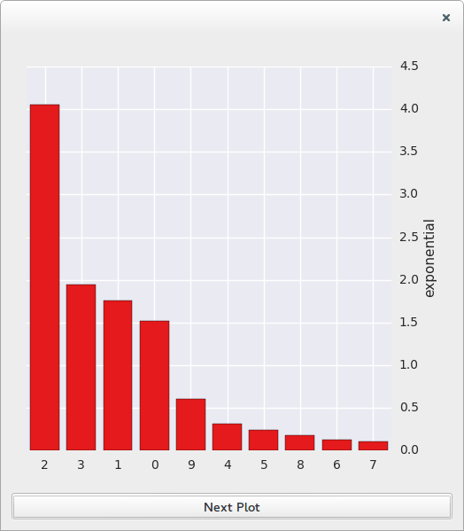
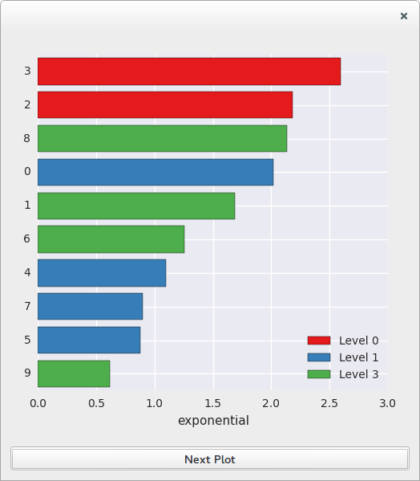
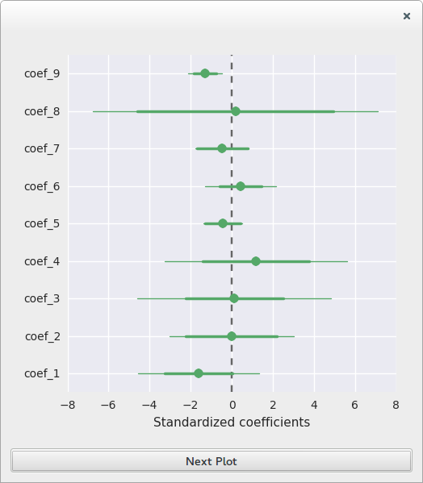
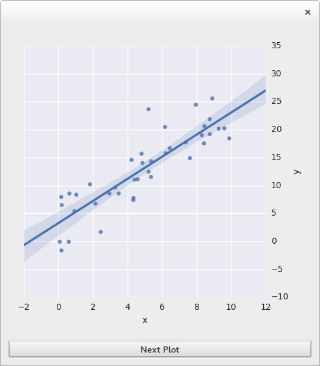
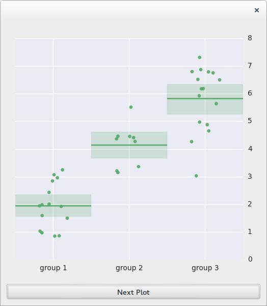
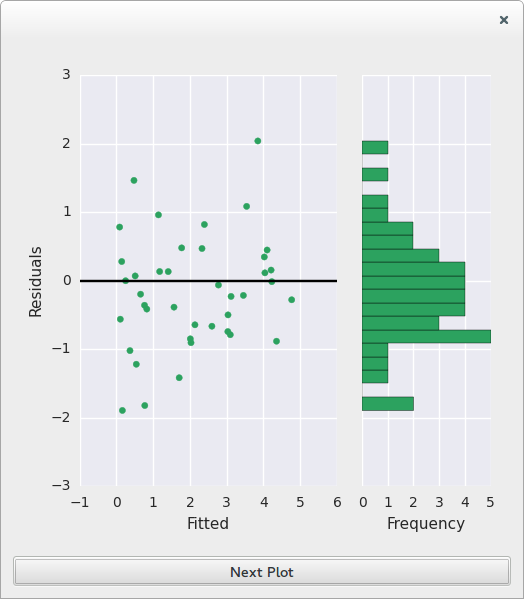
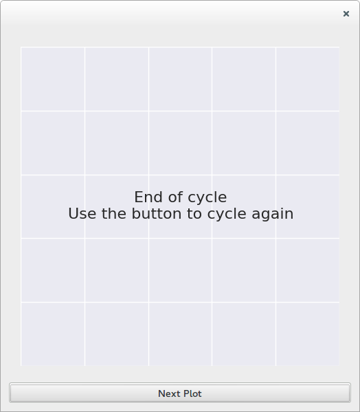

.. module:: braviz.visualization.matplotlib_qt_widget

The matplotlib widget
======================

There are two main components for the widget. On top is a QWidget which can be added to Qt applications. This widget
is capable of displaying different types of plots, which are implemented separately.

Main Widget
-----------

The :class:`MatplotWidget` is a Qt Widget which can be inserted into Qt Applications. It can generate different kinds
of plots, and all the plots should implement tooltips and context menus for the data shown. Also it should be possible
to highlight specific data-points inside each plot.

.. autoclass:: MatplotWidget
    :members:

Example
---------

This simple Qt Application illustrates the use of the :class:`MatplotWidget`. You can view the full script
:download:`here <examples/matplot_w.py>`.

The first part of the scripts import the required libraries and creates a simple Qt Frame we will use for testing

.. literalinclude:: examples/matplot_w.py
    :end-before: def draw_message

And the last lines create the widget and starts the Qt events loop

.. literalinclude:: examples/matplot_w.py
    :start-after: # Launch as stand alone if directly executed

Running just the above fragments will create the following window

.. image:: images/matplot_w1.png
    :alt: Initial view of the widget
    :align: center

Clicking on the button will call the methods inside ``self.plot_funcs`` consecutively. Each of this methods illustrate
a type of plot.

Bar plots
^^^^^^^^^^

First lets draw a simple bar plot.

.. literalinclude:: examples/matplot_w.py
    :pyobject: TestFrame.draw_bars

And now lets try a bar plot with groups data

.. literalinclude:: examples/matplot_w.py
    :pyobject: TestFrame.draw_group_bars

Try hovering the mouse over the bars.

Coefficients plot
^^^^^^^^^^^^^^^^^^

The coefficients data frame would normally come from fitting a linear model, but for this
example we are going to generate it artificially.

.. literalinclude:: examples/matplot_w.py
    :pyobject: TestFrame.draw_coefficients_plot

In this example the only coefficient that appears to be significant is number nine.
Also notice there is no ``(intercept)`` in the plot.

Scatter plots
^^^^^^^^^^^^^

First a simple case

.. literalinclude:: examples/matplot_w.py
    :pyobject: TestFrame.draw_scatter

And now lets add groups

.. literalinclude:: examples/matplot_w.py
    :pyobject: TestFrame.draw_color_scatter

.. image:: images/matplot_w6.png
    :alt: Colors scatter plot example
    :align: center

Intercept plot
^^^^^^^^^^^^^^

.. literalinclude:: examples/matplot_w.py
    :pyobject: TestFrame.draw_intercept

Residuals plot
^^^^^^^^^^^^^^^

Lets look at some artificial residuals

.. literalinclude:: examples/matplot_w.py
    :pyobject: TestFrame.draw_residuals
    :end-before: #-----------TestFrameEnd----------------------

In the example the histogram appears to be skewed, while there appears to be
a trend in the scatter plot, this may indicate that we missed a regressor
in the model.

Message plot
^^^^^^^^^^^^^^^

And finally back to a message plot

.. literalinclude:: examples/matplot_w.py
    :pyobject: TestFrame.draw_message

Plot classes
-------------

Notice that this classes are usually used through :class:MatplotWidget .
These classes are usually not used directly, however they may be useful if you want to
create additional plot types.

All plots should be subclasses of the abstract class

.. autoclass:: AbstractPlot
    :members:

The currently available plots are

.. autoclass:: MessagePlot
.. autoclass:: MatplotBarPlot
.. autoclass:: ScatterPlot
.. autoclass:: ResidualsDiagnosticPlot
.. autoclass:: InterceptPlot
.. autoclass:: CoefficientsPlot
