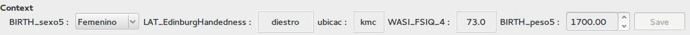

.. module:: braviz.interaction.qt_widgets

*************************************
Braviz Qt Widgets
*************************************

This module contain PyQt widgets that may be used in several applications.

.. autoclass:: ListValidator

.. autoclass:: ContextVariablesPanel
    :members:

.. autoclass:: RotatedLabel
    :members:

