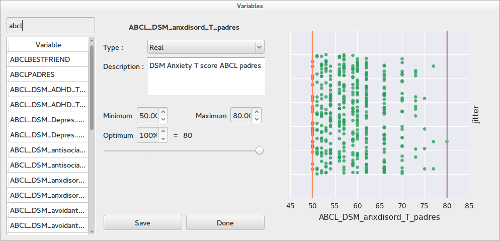
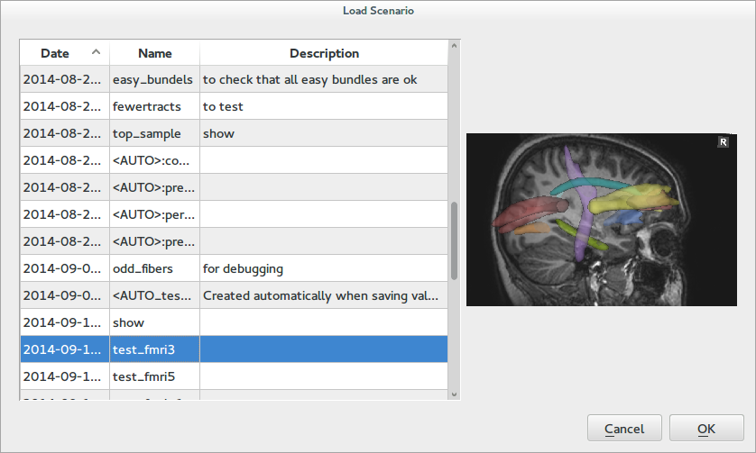

.. module:: braviz.interaction.qt_dialogs

*************************************
Braviz Qt Dialogs
*************************************

This module contain several dialogs that should be used across applications to provide a consistent
experience.

Select Variables
-----------------

A common task in Braviz is navigating the variable database and selecting variables of interest.

The variable select dialog provides an overview of the data distribution at the right side,
a panel where variable meta data can be reviewed and updated in the middle, and a variable list which
can be searched at the left.

However there are several variations of this dialog which are appropriate for different tasks.

.. autoclass:: VariableSelectDialog

.. autoclass:: GenericVariableSelectDialog

.. autoclass:: OutcomeSelectDialog

.. autoclass:: MultiPlotOutcomeSelectDialog

.. autoclass:: SelectOneVariableWithFilter

.. autoclass:: RegressorSelectDialog

.. autoclass:: ContextVariablesSelectDialog

Scenarios
----------

These dialogs are used to write and load scenarios in all applications.

.. autoclass:: LoadScenarioDialog

.. autoclass:: SaveScenarioDialog

Bundles
---------

.. autoclass:: BundleSelectionDialog

.. autoclass:: LoadLogicBundle

.. autoclass:: SaveFibersBundleDialog

.. autoclass:: SaveLogicFibersBundleDialog

Other
------
.. autoclass:: InteractionSelectDialog

.. autoclass:: NewVariableDialog
